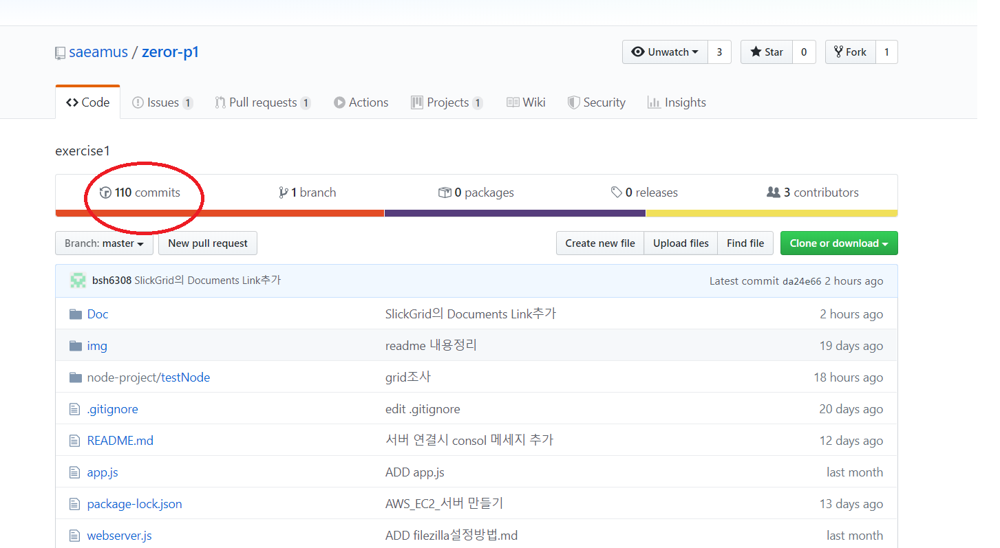
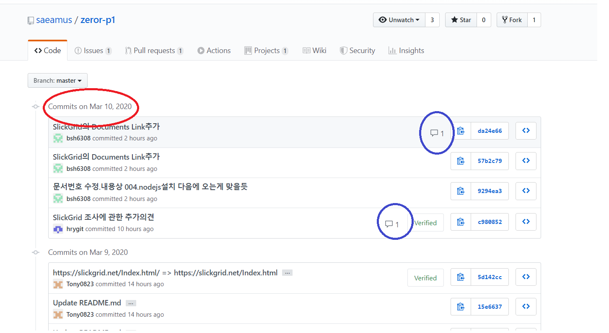
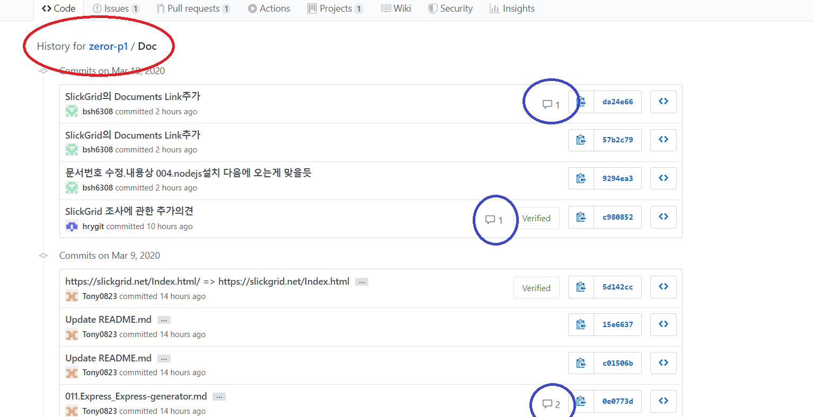
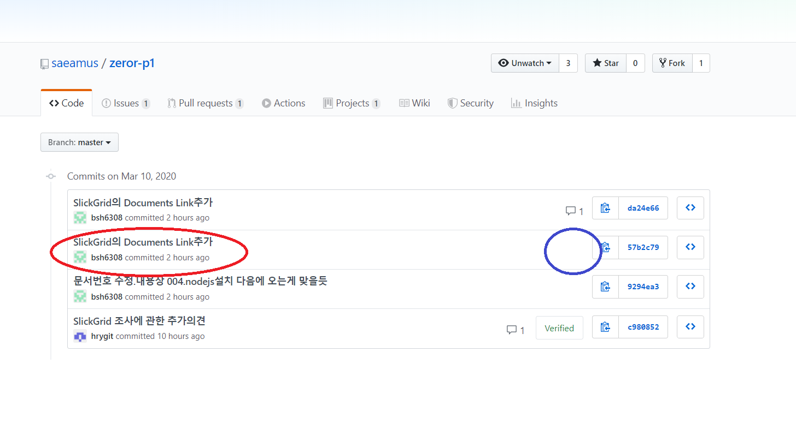
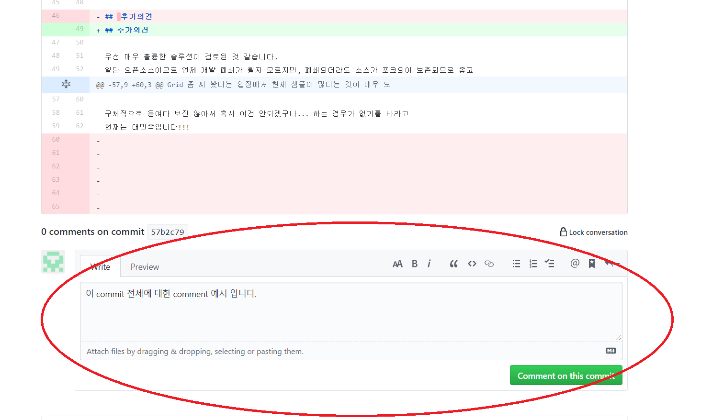
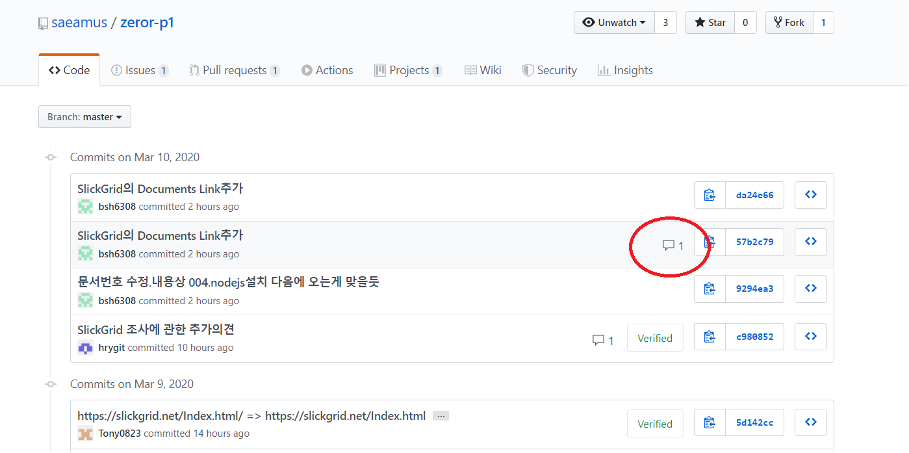
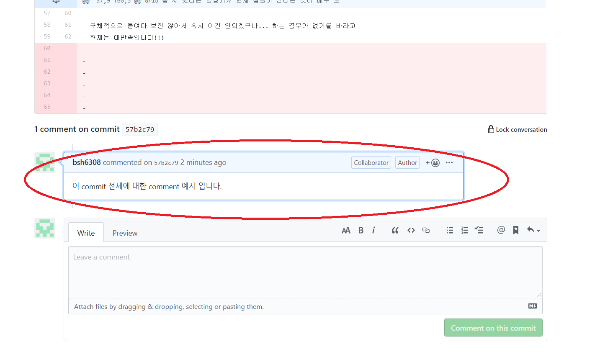
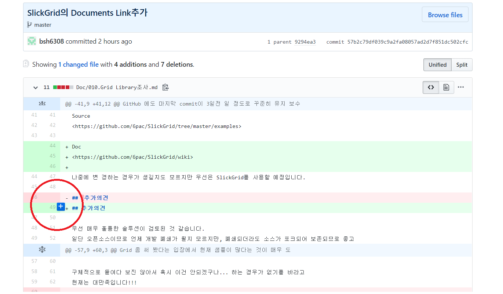
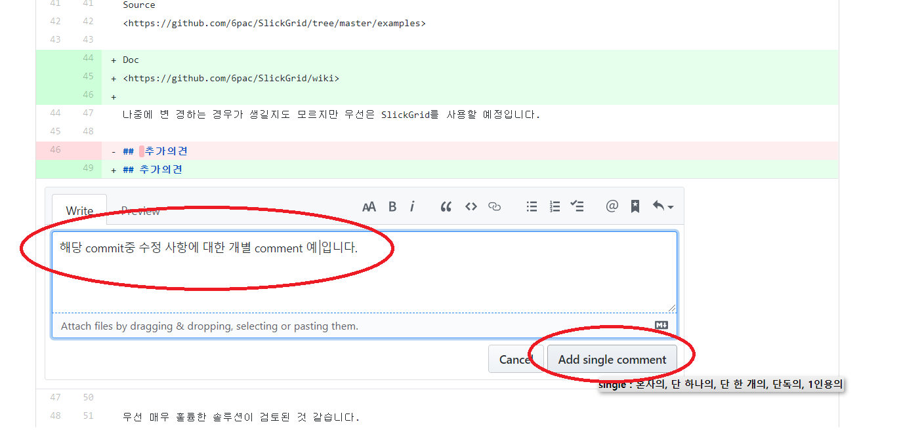
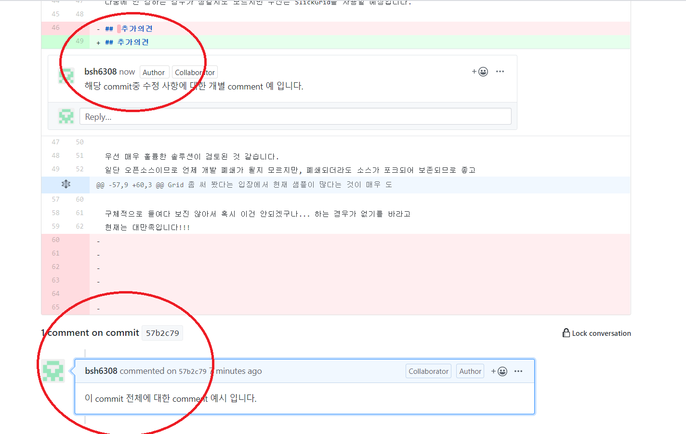

# Github에 코멘트(댓글) 다는 법, 보는 법

marco가 최근 몇몇 commit된 문서에 대해서 의견을 달았습니다.

1)문서 본문을 직접 수정한 것도 있고,  
2)comment 형식으로 의견 달아 놓은 것도 있습니다.

그런데 comment 형식으로 의견 달아 놓은 것이 email로 날라오긴 하는데, Github의 해당 문서를 찾아가 봐도 보이질 않습니다.

그래서 구글링...

## Github의 comment 개념

Github 문서에 직접 종속되는 comment를 달 수 있는 기능은 없습니다.  
현재 가능한 방법은

1. commit에 대한 comment를 달 수 있습니다. 즉, comment 종속성이 문서를 따라가는게 아니라 commit을 따라갑니다.

2. commit된 문서 내용중 각각 line별로 comment를 달 수 있습니다.

그러나 문서를 열었을 때 comment는 보이지 않습니다.  
commit목록을 보거나, 개별 문서의 history에 들어가야 comment 달림 icon이 나타납니다.

## Comment 보는 법

1. 아래 그림과 같이 레파지토리의 commit 목록 조회 버튼(빨간원)을 누릅니다.

commit 목록을 보면 해당 commit에 몇개의 comment가 달려 있는 지 나타납니다(파란원). 리스트의 commit제목을 클릭하가나 오른쪽의 comment icon을 클릭하면 comment를 볼 수 있습니다.

2. 개별 파일이나 폴더에 보면 상단 우측에 History 버튼이 있습니다.
   그 버튼을 누르면 그림과 같이 해당 폴더나 파일의 commit 리스트가 보여지고 각각의 commit에 대해 몇개의 comment가 달려 있는 지 확인 할 수 있습니다. 리스트의 commit제목을 클릭하가나 오른쪽의 comment icon을 클릭하면 comment를 볼 수 있습니다.
   

## Commit 전체에 대한 comment 달기

commit목록에서 댓글을 달고 싶은 commit을 선택합니다.

맨 아래에 댓글 입력창이 나타나고,
댓글을 작성한 후 하단의 녹색버튼 ("comment on this commit")을 클릭하여 저장합니다.

화면에 댓글이 1개 추가 되었음을 확인 할수 있습니다.

다시 해당 commit으로 들어가 보면 하단에 댓글이 하나 등록 되었음을 확인 할 수 있습니다.

## commit에서 라인별로 comment 달기

댓글을 달고자 하는 commit으로 들어 옵니다.
마우스를 본문 안에서 움직이면 파란색 십자 버튼이 나타납니다.

원하는 위치에서 파란색 버튼을 누르면 그 라인 바로 아래에 comment 입력창이 나타납니다.
comment내용을 작성하고 우하단 ("Add single comment") 버튼을 눌러 저장합니다.

다시 commit 본문으로 들어가 보면 이전에 작성한 전체 comment와 방급 전 작성한 single commemt가 잘 나타남을 확인 할 수 있습니다.

# commit시 주의 할 점

1. 지금 확인해본 바로는 comment는 무조건 commit이 기준 입니다.  
   제가 doc폴더 안의 문서가 작업 순서대로 보여지게 하느라 파일명을 전부 바꾸고 일괄적으로 commit을 했습니다.
   그리고 나서 Marco가 comment를 달았는데, 일괄작업한 commit에 딸린 댓글로 등록 되기때문에 실질적으로 comment내용과 연관이 없는 파일에도 동일한 comment가 연결되어 나타납니다.  
   파일명을 바꾸면 git은 이전 파일(old 파일명)은 삭제하고, 새로운 파일이 등록된 것으로 간주합니다.즉, 그 파일명의 최초 commit이 되는 것입니다.  
   파일명은 가능하면 안바꾸는 것이 좋을 듯합니다.

2. commit할때도 여러 작업을 일괄로 commit할 것이 아니라, 작업 내용에 따라 내용을 나누어 commit해야 나중에 comment를 확인 할때 혼동이 없을 듯 합니다.

3. comment는 commit대상이 아닙니다.
   즉, Github 안에서만 존재하는 것이지 local에 clone할때 딸려 오지는 않는 것 같습니다. comment를 달고 pull해도 변경사항이 없는 것으로 나타납니다.
