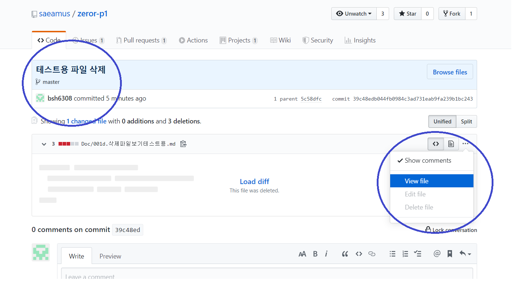
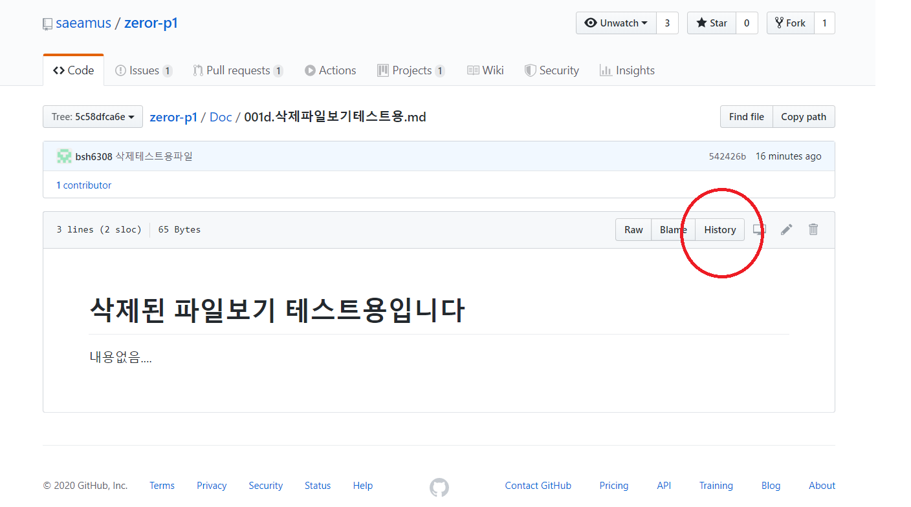
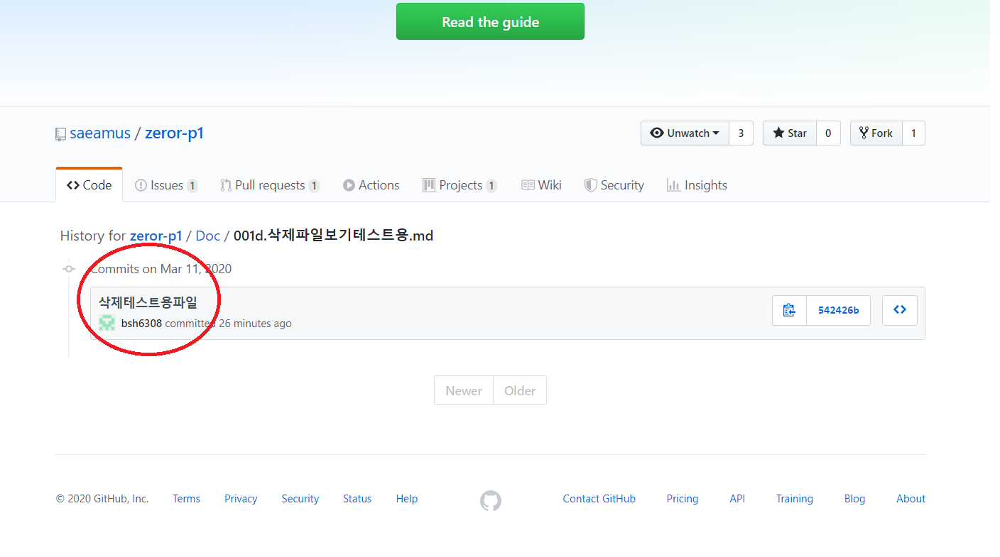
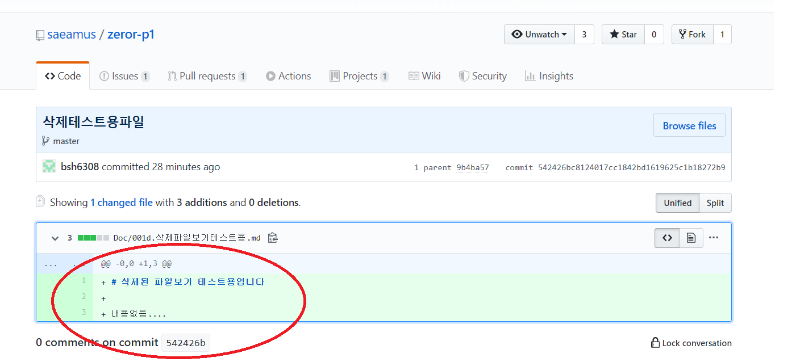

# Github 삭제된 파일보기

간단합니다.

commit list에서 삭제된 파일이 있는 commit으로 들어 갑니다.  
커밋 내용을 보면 "This file was deleted" 라고 나오네요.
오른쪽 끝의 ... 메뉴를 열면 View File이란 메뉴가 나옵니다.

클릭하면 삭제된 파일내용이 표시됩니다.  
여기서 파일의 과거 commit 이력이나 수정내역을 보려면 "History"버튼을 누릅니다.

그러면 이 파일에대한 이력이 나열되고 원하는 commit에 들어가면

아래와 같이 수정 내역을 볼수 있습니다.

