 AWS RDS 서버 구축
====================

참조 문서:

AWS Doc: <https://docs.aws.amazon.com/index.html>

AWS RDS 서비스를 이용한 MySQL DB 구축: <https://ndb796.tistory.com/220>

동영상: <https://www.youtube.com/watch?v=ljSTXfPEfjo>

AWS home page에서 콘솔에 로그인한다.

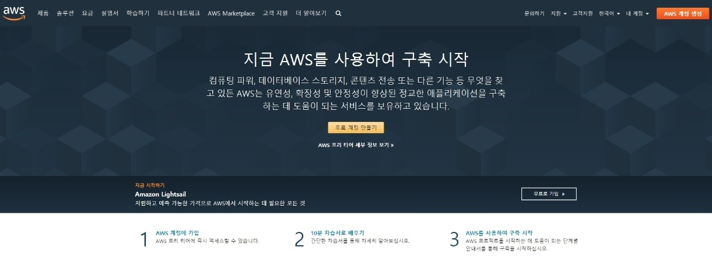      

서비스를 누른다.

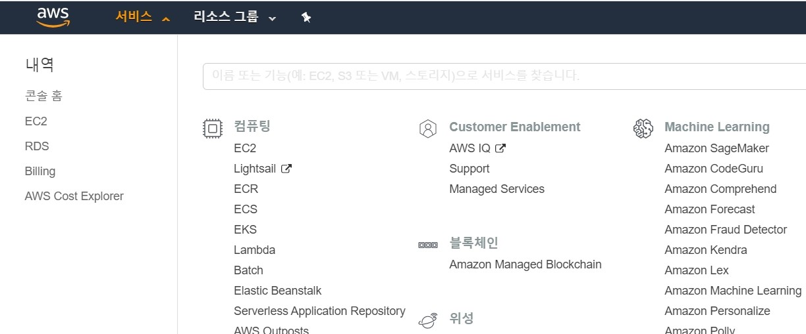    

서비스를 선택하고 콘솔 홈을 선택한다.

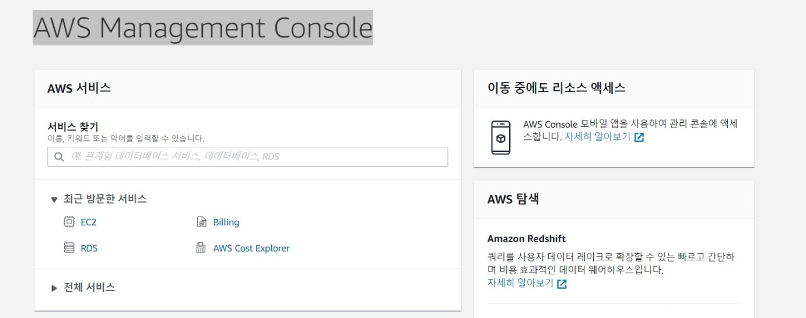   

서비스 찾기에서 RDS를 입력하고 enter를 누른다.

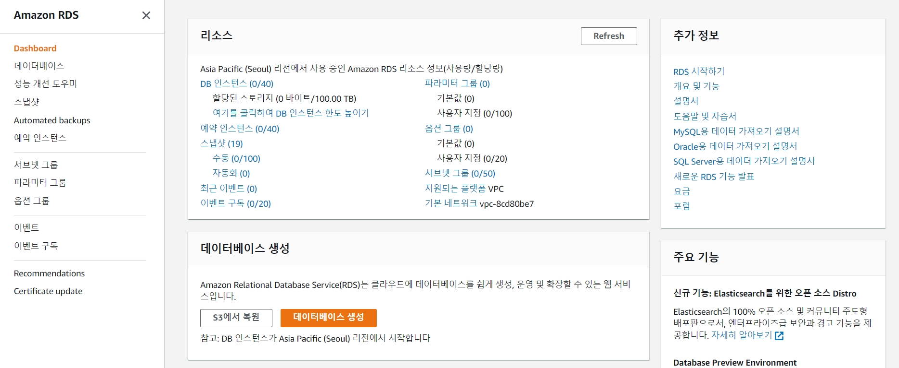

**지역은 서울로 설정하고 해당 지역에서만 사용한다.**

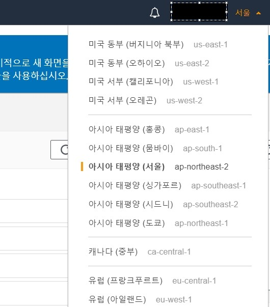</img>    
  

    
데이터베이스 생성버턴을 누른다.

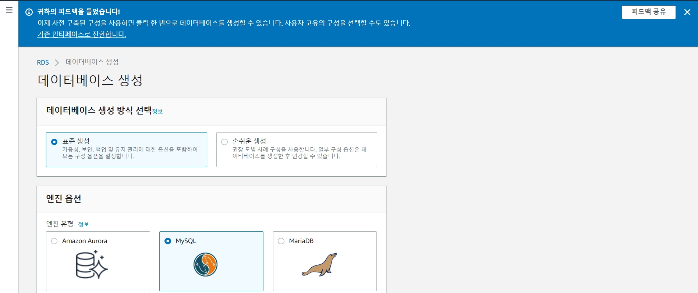   
무료인 MYSQL을 선택하고    

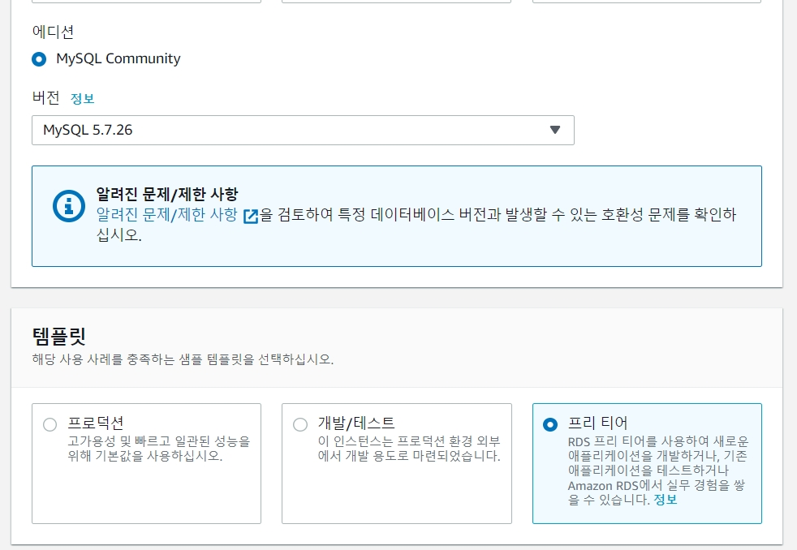 
템플릿은 프리티어를 선택한다.    

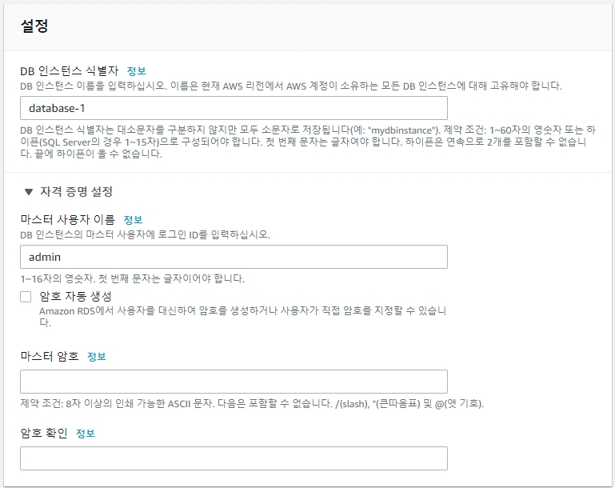     
DB 인스턴스 식별자(DB instance identifier)에 원하는 이름을 입력하고        
마스터 사용자 이름, 마스터 암호 작성한다.    
**마스터 사용자 이름, 마스터 암호는 잘보관하여야한다.**    

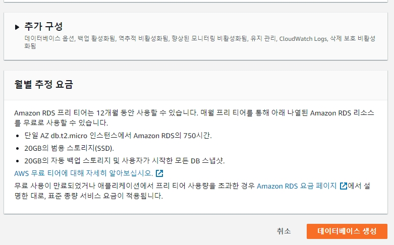    

데이터베이스생성 버턴을 누른다.    

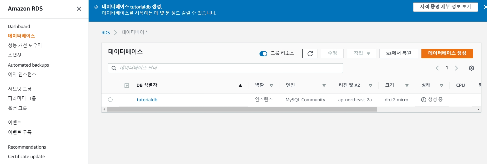    

기본적으로 MySQL은 영어로 설정되어 있으므로 한글을 넣고자 한다면 UTF-8으로 인코딩 설정을 해야 합니다.    
db에 한글을 넣기 위해서는 파라미터 그룹을 선택한다.   

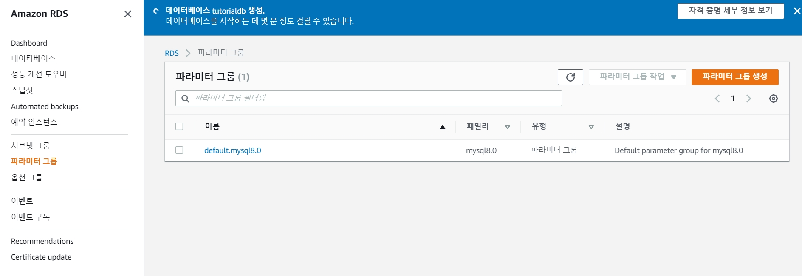     

파라미터그룹생성 버턴을 누른다.

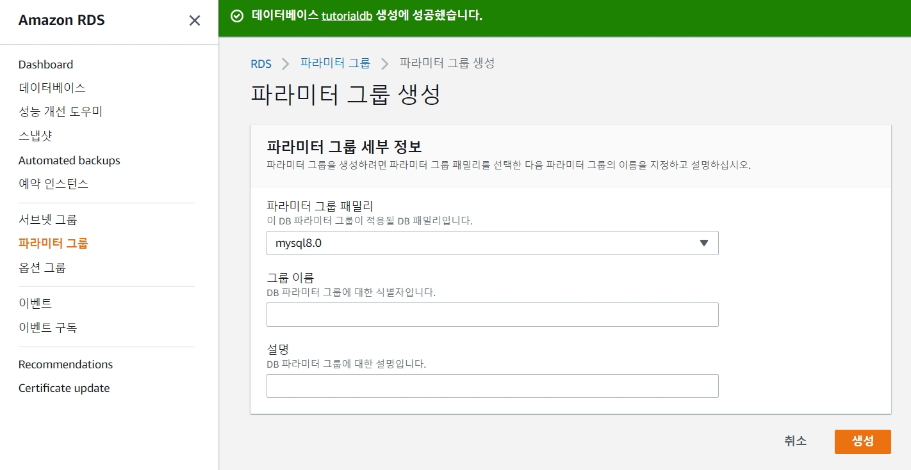     

그룹이름에 Hangul을 넣고 설명도 넣고 **생성** 버턴을 누른다.

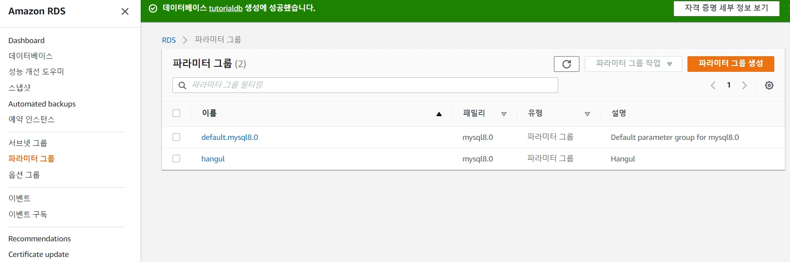   

Hangul을 선택하고 **파라미터 그룹작업**에서 **편집**을 선택한다.
또는 **Hangul**을 두번 연속 클릭한다.    

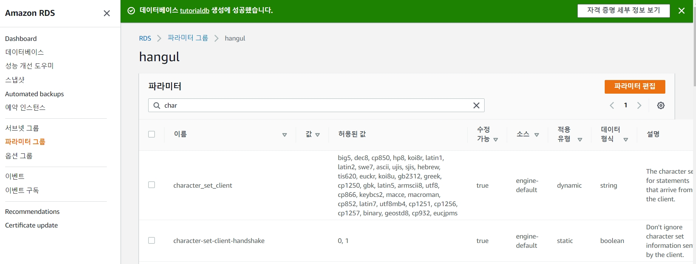      

파라미터 입력창에 char을 입력한다.

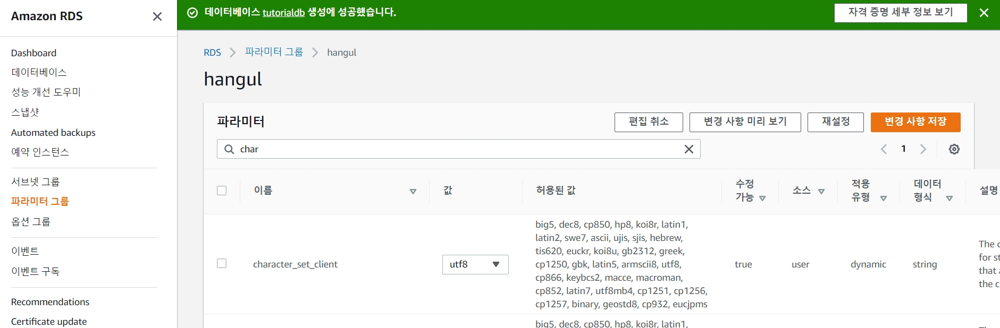    

**파라미터편집** 버턴을 누르고 char로 검색된 모든 함목에 대해서 
모든 값을 utf-8로 수정하고 저장한다.        

파라미터 입력창에 collation을 입력하고 찾아서  collation\_connection, collation\_server 값을
utf8\_general\_ci로 수정하고 저장한다.    

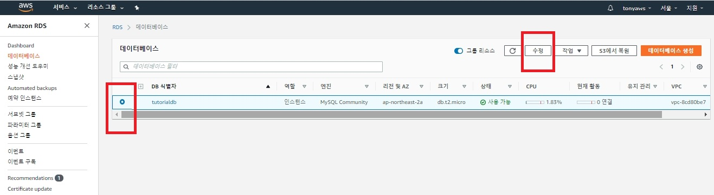    

데이터베이스에서 DB 식별자를 선택하고 수정 버턴을 누른다.    

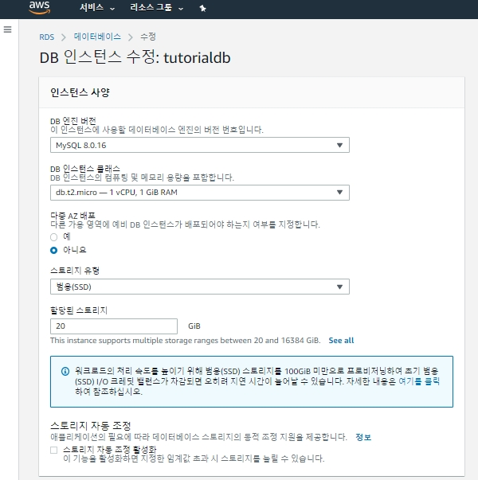

밑으로 내리면 데이터 옵션 항목이 나온다.    
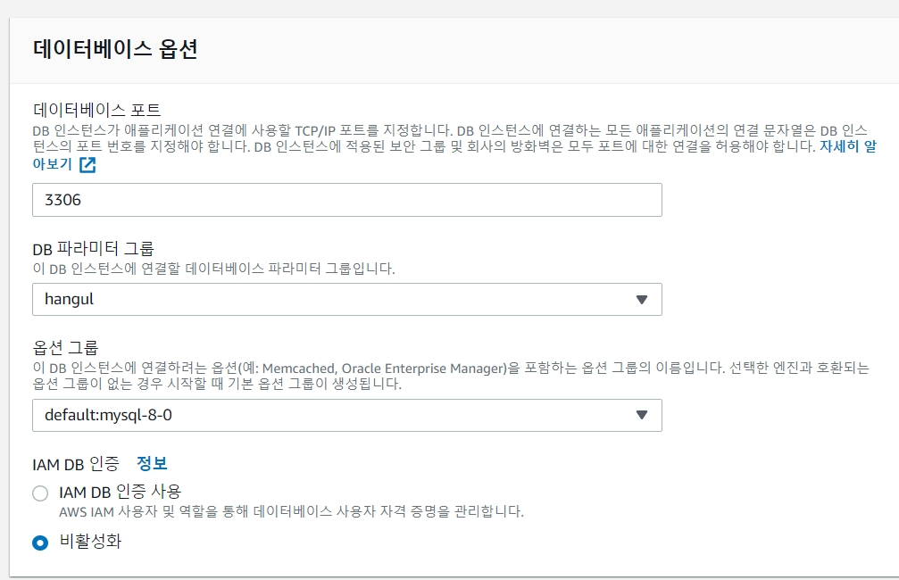

**DB 파라미터그룹**에서 hangul을 선택한다.

밑으로 내려서 **계속** 버턴을 누른다.

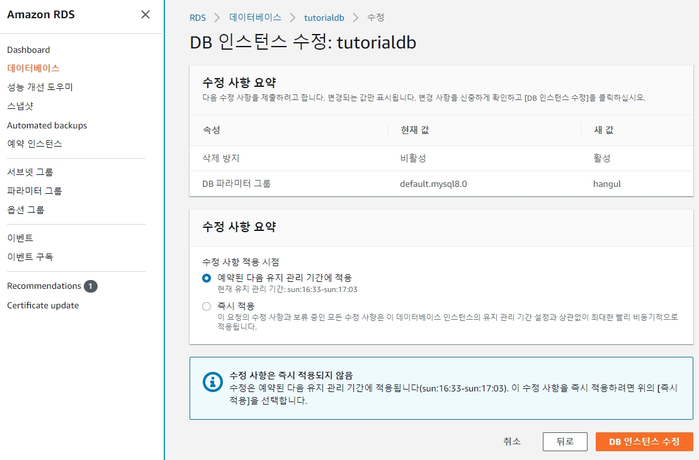

**DB 인스턴스 수정** 버턴을 누른다.

**추가 사항:**    
DB data가 생성된 시간이 다르게 나타나는 문제가 생겨서 서버 Timezone 설정을 변경하여야 합니다.    
[Timezone.md](https://github.com/saeamus/zeror-p1/blob/master/Doc/Timezone.md) 문서를 참조바랍니다.

