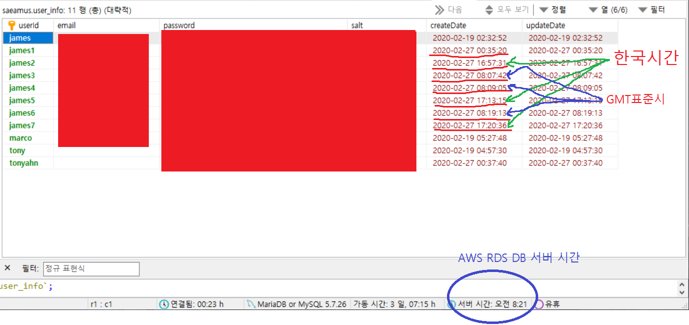
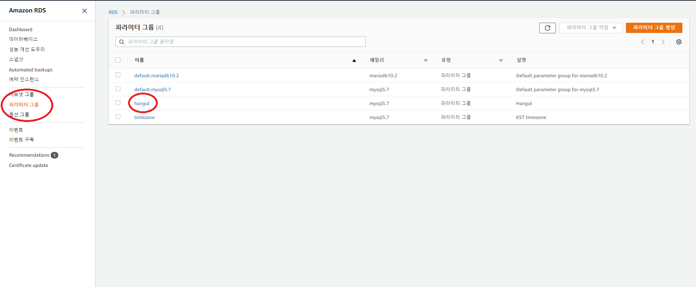
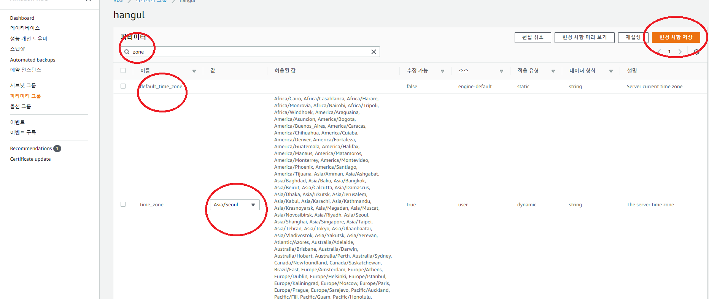
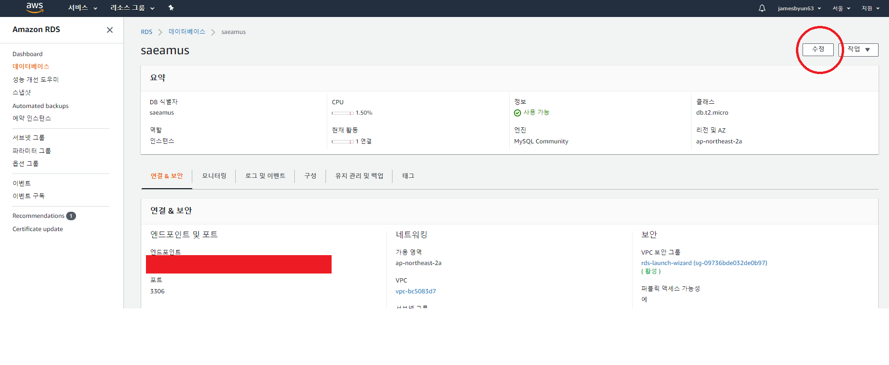
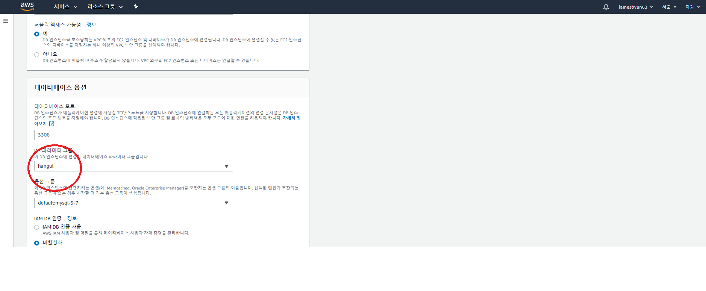
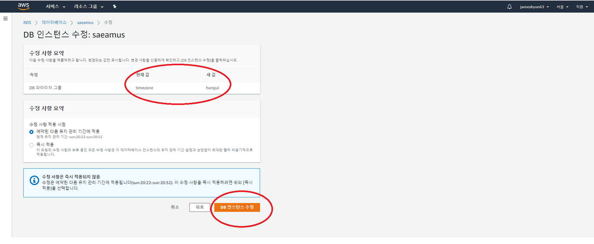
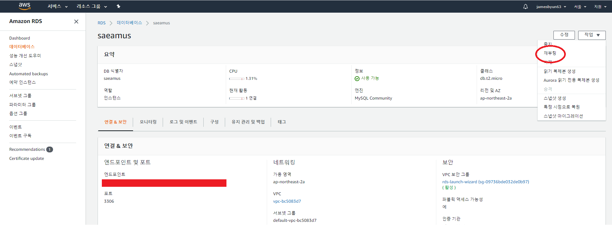
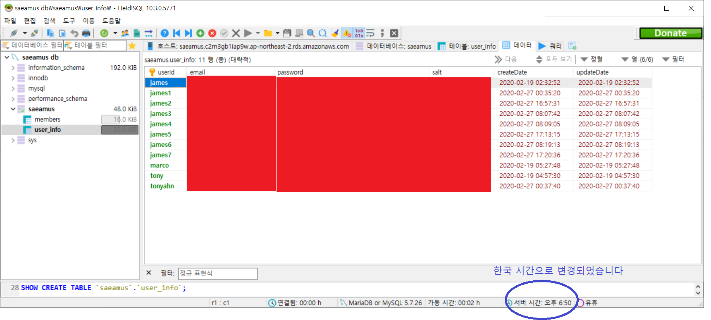

# 서버 Timezone 설정하기

회원 가입 프로그램 TEST중 이상한 점을 발견했습니다.  
그림과 같이 data가 생성된 시간이 다르게 나타납니다.  
맨아래 파란색원으로 표시된 DB 서버의 시간도 다르구요...

## 원인

녹색 화살표는 localhost에서 회원 가입을 테스트한 경우 입니다.  
컴퓨터에서 시간계산을 하므로 한국 시간이 정상적으로 나타나 있네요...

파란색 화살표는 AWS EC2 서버에 접속하여 회원 가입한 경우 입니다.  
한국 시간보다 9시간 빠른 GMT 표준시로 기록이 되어 있습니다.  
서버에서 시간 계산을 했기 때문입니다.

아래쪽 파란원은 AWS RDS DB 서버의 시간입니다.
EC2 서버와 동일하게 GMT 표준시로 되어 있습니다.

<U>AWS EC2 나 RDS 서버의 표준 시간대는 Coordinated Universal Time(UTC) 를 사용하기 때문입니다.</U>

## UTC(Coordinated Universal Time)란?

협정 세계시(協定世界時, 프랑스어: Temps Universel Coordonné, 영어: Coordinated Universal Time) 또는 UTC(협정 세계표준시)는 1972년 1월 1일부터 시행된 국제 표준시이다. UTC는 국제원자시와 윤초 보정을 기반으로 표준화되었다.

UTC는 그리니치 평균시(GMT)에 기반하므로 GMT로도 불리기도 하는데, UTC와 GMT는 초의 소숫점 단위에서만 차이가 나기 때문에 일상에서는 혼용되어 사용된다. 기술적인 표기에서는 UTC가 사용된다.  
-출처: 위키백과

## AWS EC2 서버의 Timezone 설정

현재 시간 체크

    ubuntu@ip-172-31-34-32:~$ date
    Thu Feb 27 08:15:17 UTC 2020

    ubuntu@ip-172-31-34-32:~$ sudo date
    Thu Feb 27 08:15:29 UTC 2020

현재 시간 기준이 어디인지 확인(UTC로 되어 있습니다)

    ubuntu@ip-172-31-34-32:~$ sudo cat /etc/localtime
    TZif2                                         UTC   TZif2                                                UTC
    UTC0

기존의 시간 파일을 삭제

    ubuntu@ip-172-31-34-32:~$ sudo rm /etc/localtime

한국시간파일을 복사하지않고, 링크시킨다

    ubuntu@ip-172-31-34-32:~$ sudo ln -s /usr/share/zoneinfo/Asia/Seoul /etc/localtime

현재 시간 확인

    ubuntu@ip-172-31-34-32:~$ date
    Thu Feb 27 17:18:42 KST 2020

    ubuntu@ip-172-31-34-32:~$ sudo date
    Thu Feb 27 17:18:48 KST 2020

이제 한국시간(KST)으로 변경되었습니다.

## AWS RDS 서버의 Timezone 설정

[ Link : AWS 문서로 가기](https://aws.amazon.com/ko/premiumsupport/knowledge-center/rds-change-time-zone/)

#### AWS문서에는 아래와 같이 DB 인스턴스 마다 설정 방법이 다르다고 설명합니다.

#### Amazon RDS DB 인스턴스의 시간대를 변경하려면 어떻게 해야 합니까?

최종 업데이트 날짜: 2019년 11월 15일

#### 간략한 설명

모든 Amazon RDS DB 인스턴스는 기본적으로 UTC/GMT 시간을 사용하며, 시간대 변경은 선택 사항입니다. 데이터베이스 계층에서는 UTC 시간대를 사용하는 것이 제일 좋습니다. 하지만 현지 시간대를 사용해야 하는 경우에는 항상 애플리케이션 계층에서 시간대를 변환하십시오. 시간대를 변경하기 전에 데이터베이스 관리자 또는 애플리케이션 팀에 문의하십시오.

#### 해결 방법

Amazon RDS DB 인스턴스의 시간대를 수정하는 데 필요한 단계는 데이터베이스 엔진에 따라 다릅니다.

Oracle – Amazon RDS Oracle DB 인스턴스의 시간대를 수정하려면 데이터베이스 시간대 설정을 참조하십시오. 시간대를 변경하려면 Oracle 데이터베이스 엔진 버전 11.2.0.2.v4가 필요합니다.

PostgreSQL – 데이터베이스 수준에서 Amazon RDS PostgreSQL DB 인스턴스의 시간대를 수정하려면 사용자 지정 파라미터 그룹에서 시간대 파라미터의 값을 설정합니다. 시간대 파라미터는 UTC-X 또는 UTC+X의 입력 형식을 취합니다. 여기서 X는 UTC 시간에서 시간대를 상쇄해야 하는 시간의 수입니다.

중요: PostgreSQL은 UTC-5와 "America/New_York"으로 참조되는 경우 시간대를 다르게 처리합니다. 예를 들어 시간대 "America/New_York"에는 UTC-5가 표시됩니다. 시간대를 UTC-5로 설정하면 UTC+5로 업데이트됩니다. 자세한 내용은 Date/Time Types에 대한 PostgreSQL 문서를 참조하십시오.

MySQL – <U>MySQL 5.5, 5.6 또는 5.7을 실행하는 DB 인스턴스의 시간대를 변경하려면 DB 인스턴스의 DB 파라미터 그룹에서 time_zone 파라미터를 설정합니다. 파라미터 그룹을 사용하는 모든 DB 인스턴스와 읽기 전용 복제본이 새로운 시간대를 사용하도록 변경됩니다.</U> 5.5 이전 버전의 Amazon RDS MySQL 시간대는 변경할 수 없습니다. 기본적으로 RDS MySQL DB 인스턴스의 시간대는 UTC(협정 세계시)입니다. 자세한 내용은 MySQL DB 인스턴스의 현지 시간대를 참조하십시오.

Amazon Aurora – Amazon Aurora DB 클러스터의 시간대를 변경하려면 Amazon Aurora DB 클러스터의 현지 시간대를 참조하십시오.

MariaDB – MariaDB를 실행하는 DB 인스턴스의 시간대를 변경하려면 DB 인스턴스의 DB 파라미터 그룹에서 time_zone 파라미터를 설정합니다. 파라미터 그룹을 사용하는 모든 DB 인스턴스와 읽기 전용 복제본이 새로운 시간대를 사용하도록 변경됩니다. 기본적으로 RDS MariaDB DB 인스턴스의 시간대는 UTC(협정 세계시)입니다. 자세한 내용은 MariaDB DB 인스턴스의 현지 시간대를 참조하십시오.

SQL Server – 시간대를 변경하려면 새로운 Amazon RDS for SQL Server 인스턴스를 생성할 때 시간대를 지정합니다. DB 인스턴스를 생성할 때 추가 구성 섹션을 확장하고 시간대 메뉴에서 원하는 시간대를 선택합니다. 인스턴스가 생성된 후에는 시간대를 수정할 수 없습니다. 자세한 내용은 Microsoft SQL Server DB 인스턴스의 현지 시간대를 참조하십시오.

### 이 프로젝트에서는 MySql DB를 사용하므로 DB 파라메터 그룹에서 Timezone을 변경해 봅니다.

좌측의 파라메타 그룹을 선택하고 한글폰트용 으로 만들어 놓은 hangul 그룹을 선택합니다.(파라메터 그룹은 1개 밖에 선택이 안되므로 이미 만들은 hangul그룹에 추가로 timezone을 설정하는 것입니다.)

검색창에 zone을 입력하면  
default_time_zone 이 검색되고  
파라메타편집 버튼을 눌러  
timezone을 "Asia/Seoul" 로 설정하고  
 변경사항 저장을 누릅니다.

DB 인스턴스의 수정 버튼을 누릅니다

파라메타 그룹 "Hangul"을 선택합니다.

맨아래 "게속" 버튼을 누르면  
그림과 같이 변경사항이 표시되고,  
맨아래의 DB인스턴스 수정 버튼을 누릅니다.  
그러면 DB가 수정중 인 상태로 바뀌고  
사용가능 상태로 바뀔 때 까지 기다립니다.

사용가능 상태가 되면 우상단의 "작업/재부팅" 을 선택하여 DB를 재부팅합니다.  
재부팅이 끝나고 사용가능 상태가 될때 까지 기다립니다.

이제 DB를 연결하면 그림과 같이 DB 서버의 시간이 한국시간으로 변경된 것을 확인할 수 있습니다.

