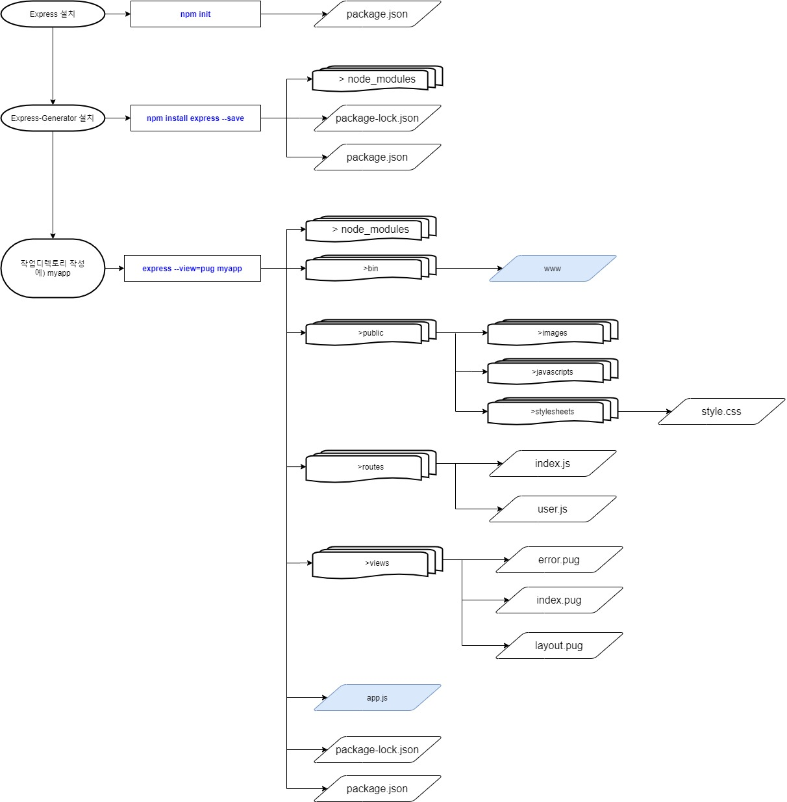
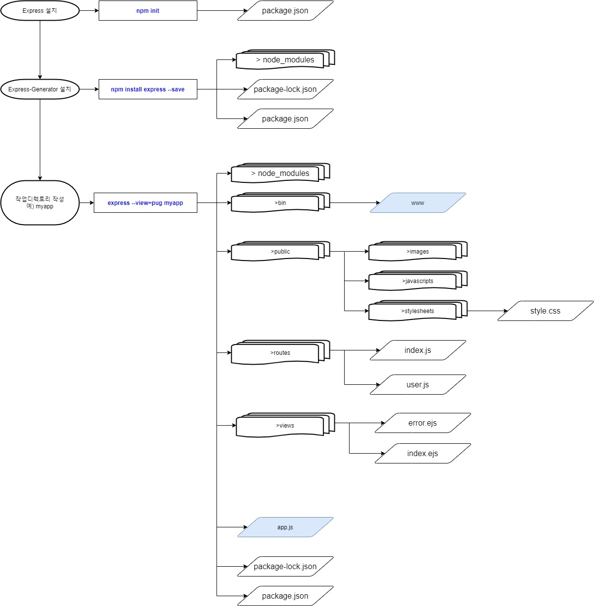

# Express설치 
참조 사이트:    
https://expressjs.com/    
https://aljjabaegi.tistory.com/357    

## 목적
Express는 웹 및 모바일 애플리케이션을 위한 일련의 강력한 기능을 제공하는 간결하고 유연한 Node.js 웹 애플리케이션 프레임워크입니다. 자유롭게 활용할 수 있는 수많은 HTTP 유틸리티 메소드 및 미들웨어를 통해 쉽고 빠르게 강력한 API를 작성할 수 있습니다. Express는 Node.js로 웹 애플리케이션을 쉽게 만들기 위해서 사용합니다.    

## 설치방법
구글 검색 창에서 “node설치” 입력하고 검색된 node.js 설치하는 방법에 따라 설치 하십시요.    
또는 https://opentutorials.org/course/3332/21029 참조바랍니다.    

명령프롬프트 창에서 원하는 디렉토리를 만들고     
예) C:\Work
그 디렉토리로 가서 (C:\Work) 아래의 명령들을 순서대로 입력합니다.    

**view engine=pug 인 경우**    

    npm init				// package.json 파일을 작성합니다.    
    npm install express --save    
    npm install -g express-generator    
    express --view=pug myapp    
    cd myapp    
    npm install				//종속성을 설치    
    set DEBUG= myapp:* & npm start    

**view engine= ejs 인 경우**    

    npm init    
    npm install express --save    
    npm install -g express-generator    
    express --view=ejs myapp    
    cd myapp    
    npm install    
    set DEBUG= myapp:* & npm start        

**view engine=pug 인 경우**   

 

**view engine= ejs 인 경우**     

    

1.npm init 명령을 이용하여 애플리케이션에 대한 package.json 파일을 만듭니다.    
 
    npm init

이 명령을 실행하면 애플리케이션의 이름 및 버전과 같은 몇 가지 정보에 대해 표시합니다. 
enter를 계속해서 쳐서 진행하고 마지막에 yes를 입력합니다.

2.Express를 설치한 후 종속 항목 목록에 저장하십시오    

    npm install express --save    
아래와 같이 디렉토리와 파일들이 만들어 집니다.
>node_modules    
package-lock.json    
package.json    

3.express-generator 설치    

    npm install -g express-generator    

4.다음은 myapp 라는 Express 앱을 만듭니다.   
Node.js에는 응답페이지를 독립적으로 작성하고, 활용할 수 있도록 뷰 엔진(view engine)이라는 시스템이 준비되어 있습니다. 뷰 엔진(view engine)으로 표시하는 웹페이지를 템플릿 문서(Template Document)라고 부르고, 이 템플릿 문서에 데이터 변수 값을 노출할 수 있는 방법을 제공합니다. 대표적인 것이  EJS와 PUG(과거 Jade)라는 템플릿 모듈입니다.    

앱은 현재 작업 디렉토리의 myapp 폴더에 생성되며, 뷰 엔진이 Pug인 경우는    

    express --view=pug myapp    

뷰 엔진이 EJS인 경우는    

    express --view=ejs myapp    

5.종속성을 설치하십시오.    
cd myapp
npm install

6.Windows에서는 다음 명령으로 앱을 실행하십시오.    
    set DEBUG=myapp:* & npm start    

7.http://localhost:3000/ 브라우저에 접속하십시오.   

    Express
    Welcome to Express    
    
위와 같이 나오면 정상적으로 설치가 완료된 것입니다.

