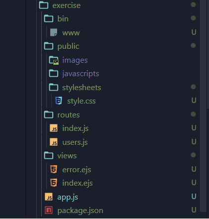

### 이글은 node-project/testNode 폴더의 readme.md 를 옮겨 놓은 것입니다.

### 004a번 글과 중복되는 내용이 있을 수 있습니다.

# 어플리케이션 생성 및 폴더의 구조

## 어플리케이션의 생성

### 1. Epxress란?

Node는 Express, Koa, Hapi와 같은 프레임워크를 사용하여 개발할 수 있습니다.

위의 프레임워크들이 개발에 필요한 다양한 기능들을 지원하기 때문에, 개발 생산성이 높아집니다.

### 2. Express 프레임워크 설치

    $ npm install express --save

### 3. express-generator 모듈 설치

express-generator 모듈로 어플리케이션을 생성하면 프로젝트 뼈대를 만들어 줍니다.(기본 폴더와 파일을 자동으로 생성합니다.)
우선 exporess-generator 모듈은 내장 모듈이 아니므로, npm을 통해 모듈을 설치해야 합니다.

    $ npm install –g express-generator

### 4. 어플리케이션 생성

express-generator로 exercise라는 이름의 스켈레톤 애플리케이션을 생성합니다.

    $ express exercise --view=ejs

실행 화면은 아래와 같습니다.

exercise라는 폴더 아래에 그림과 같이 기본 폴더와 파일들이 생성됩니다.

### 5. 어플리케이션의 실행

아래 명령을 실행하면 어플리케이션이 실행됩니다.

    $ cd exercise
    $ npm install
    $ npm start

어플리케이션이 실행되고 웹브라우저에서 localhost:3000으로 접속하면 아래와 같은 화면이 출력됩니다. 이는 서버가 정상 설치 된 것이며 이제 여러분의 의도대로 프로그램을 수정 작성하면 됩니다.

#### npm install을 하는 이유

package.json 파일에 dependencies 프로퍼티에 필요한 모듈들이 정의되어 있습니다.

이 모듈들은 express-generator가 생성해준 것입니다.

npm install명령어를 실행하면, package.json 파일의 dependencies 프로퍼티를 보고 모듈을 설치합니다.

즉, dependencies 에는 모듈을 사용하겠다고 선언만 한 것이고, 진짜로 설치를 하려면 npm install을 해주어야 합니다.

## 어플리케이션 폴더의 구조 및 역할

express-generator로 애플리케이션을 생성하면, 아래와 같은 폴더/파일들이 자동으로 추가됩니다.

#### bin 폴더

프로그램의 실행과 관련된 파일이 있는 폴더입니다.
www 파일을 실행해서 서버가 실행됩니다.  
현재 testNode 어플리케이션에서는 App.js파일에 서버가 꾸며져 있습니다.

#### pulbic 폴더

JS, CSS, img 파일 등 리소스 파일이 있는 폴더

#### routes 폴더

라우터와 관련된 모듈이 있는 폴더

#### views 폴더

ejs 파일과 같은 템플릿 파일이 있는 폴더  
브라우저로 전송되는 view파일을 모아 놓은 폴더

#### app.js 파일

애플리케이션에서 중심이 되는 파일  
서버 설정 / 미들웨어 정의 / 라우트 정의 등 여러가지를 설정하고, 서버 운영을 위한 로직을 작성합니다.

#### package.json

현재 애플리케이션과 관련된 정보와 필요한 모듈들을 작성해 놓은 파일 npm install 을 실행하면 dependencies 항목에 작성되 있는 모듈들이 PC에 설치된다.
