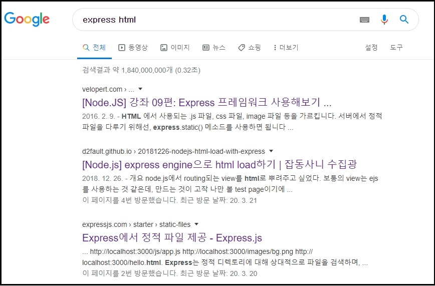
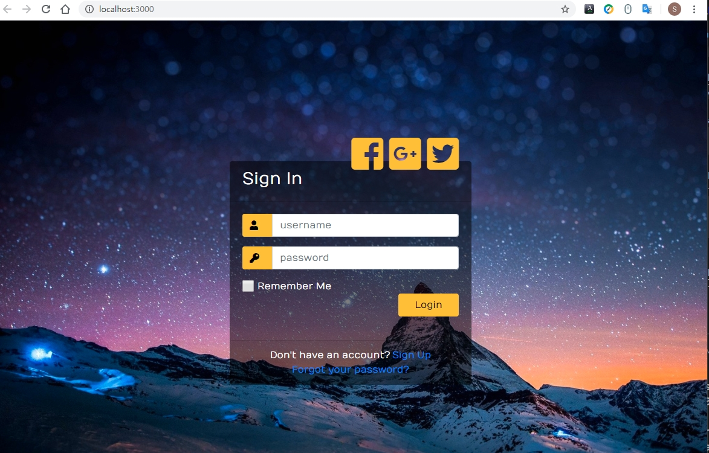

# Express를 이용하여 web page에 login 창을 만든다.
[005.로그인.md](https://github.com/saeamus/zeror-p1/blob/master/Doc/005.%EB%A1%9C%EA%B7%B8%EC%9D%B8.md)에서 본 것처럼 로그인 창을 html파일을 이용하여 만들어 보았습니다.    
Express 설치는  [004a.Express_Express-generator.md](https://github.com/saeamus/zeror-p1/blob/master/Doc/004a.Express_Express-generator.md)를 참고하여 하시기 바랍니다.    

## 목적
Express를 이용하여 로그인 창을 만들어 보겠습니다.

## 조사
만들어 본 login.html 파일을 어떻게 Express 구조에 실어서 보이게 하느냐가 핵심 사항입니다.    
구글에서 “express html”을 찾아봅니다.    

    


### [[Node.JS] 강좌 09편: Express 프레임워크 사용해보기](https://velopert.com/294)    

### 1.Express server생성 하고 접속시 Cannot GET /라는 문구 나타남:
		Router 정의가 안되어 있어서 나타남.
	    
    C:\Work_saeamus_zeror-p1\express-project\myapp>**node server1.js**
    http://localhost:3000/    
    Cannot GET /    

### 2.Router로 Request 처리하기: 간단한 router를 작성    

    app.get('/', function(req, res){
        res.send('Hello World');
    });

위 코드를 server1.js에 추가하여server2.js를 만들고 아래와 같이 서버를 구동합니다.

    C:\Work_saeamus_zeror-p1\express-project\myapp>node server2.js
    events.js:180
          throw er; // Unhandled 'error' event
                  ^
    Error: listen EADDRINUSE: address already in use :::3000    

실행중인 node server가 있어서 동작이 안되는 경우이므로
실행중인 node를 죽이는 방법은 아래와 같이 하면 됩니다.    

    netstat -ano|findstr (port번호)
    netstat -ano|findstr 3000
    C:\Work_saeamus_zeror-p1\express-project\myapp>netstat -ano|findstr 3000
      TCP    0.0.0.0:3000           0.0.0.0:0             LISTENING       12456
    TCP    [::]:3000              [::]:0                 LISTENING       12456

    실행중인  node 서버를 강제 종료하기.
    taskkill  /f  /pid  (종료할 pid)
    taskkill  /f  /pid  12456
    C:\Work_saeamus_zeror-p1\express-project\myapp>taskkill  /f  /pid  12456
    성공: 프로세스(PID 12456)가 종료되었습니다.

    실행중인  node 서버를 전체 강제 종료하기.
    taskkill /IM node.exe /F     

서버를 구동합니다.   
    C:\Work_saeamus_zeror-p1\express-project\myapp>node server2.js    

    Express server has started on port 3000
    http://localhost:3000/
    Hello World
route app.get('/', function(req, res){ 가 정상 동작함을 알 수 있습니다.    

라우터 코드와 서버 코드는 다른 파일에 작성하는 것이 좋은 코딩 습관입니다.   
router 라는 폴더를 만들고 그 안에 main.js 를 생성해주세요.    

    module.exports = function(app)
    {
        app.get('/',function(req,res){
            res.render('index.html')
        });
        app.get('/about',function(req,res){
            res.render('about.html');
        });
    }

### 3.HTML 페이지를 띄우기: views/ 디렉토리를 만들고, 그 안에 index.html 과 about.html 을 생성    
index.html      
```
<html>
  <head>
    <title>Main</title>
    <link rel="stylesheet" type="text/css" href="css/style.css">
  </head>
  <body>
    Hey, this is index page
  </body>
</html> 
```   
about.html        
```
    <html>
      <head>
        <title>About</title>
        <link rel="stylesheet" type="text/css" href="css/style.css">
      </head>
      <body>
    Hey, this is about page
      </body>
    </html>   
```
server2.js 를 아래와 같이 업데이트하여 server3.js를 만듭니다. 

server3.js    
```
var express = require('express');
var app = express();
//라우터 모듈인 main.js 를 불러와서 app에 전달
var router = require('./router/main')(app);

//서버가 읽을 수 있도록 HTML 의 위치를 정의
app.set('views', __dirname + '/views');
//서버가 HTML 렌더링을 할 때, EJS 엔진을 사용하도록 설정
app.set('view engine', 'ejs');

app.engine('html', require('ejs').renderFile);

var server = app.listen(3000, function(){
    console.log("Express server has started on port 3000")
});
```
### 4.정적 파일 (Static files) 다루기   

정적 파일이란? HTML 에서 사용되는 .js 파일, css 파일, image 파일 등을 가리킵니다.
서버에서 정적파일을 다루기 위해선, express.static() 메소드를 사용하면 됩니다.
public/css 디렉토리를 만드시고 그 안에 style.css 파일을 생성해주세요.
app.use(express.static('public'));

### [[Node.js] express engine으로 html load하기](https://d2fault.github.io/2018/12/26/20181226-nodejs-html-load-with-express/)    

consolidate, mustache 모듈을 사용하여 html을 보여준다.

### [Express에서 정적 파일 제공 - Express.js](https://expressjs.com/ko/starter/static-files.html)    

이미지, CSS 파일 및 JavaScript 파일과 같은 정적 파일을 제공하려면 Express의 기본 제공 미들웨어 함수인 express.static을 사용하십시오.    
정적 자산이 포함된 디렉토리의 이름을 express.static 미들웨어 함수에 전달하면 파일의 직접적인 제공을 시작할 수 있습니다.    
예를 들면, 다음과 같은 코드를 이용하여 public이라는 이름의 디렉토리에 포함된 이미지, CSS 파일 및 JavaScript 파일을 제공하십시오.    

    app.use(express.static('public'));    

이제 다음과 같이 public 디렉토리에 포함된 파일을 로드할 수 있습니다.
```
        http://localhost:3000/images/kitten.jpg    
        http://localhost:3000/css/style.css        
        http://localhost:3000/js/app.js    
        http://localhost:3000/images/bg.png    
        http://localhost:3000/hello.html    
```
여러 개의 정적 자산 디렉토리를 이용하려면 다음과 같이 express.static 미들웨어 함수를 여러 번 호출하십시오.    

        app.use(express.static('public'));
        app.use(express.static('files'));

Express는 express.static 미들웨어 함수를 이용해 정적 디렉토리를 설정한 순서대로 파일을 검색합니다.    
express.static 함수를 통해 제공되는 파일에 대한 가상 경로 접두부(파일 시스템 내에 해당 경로가 실제로 존재하지 않는 경우)를    
작성하려면, 아래에 표시된 것과 같이 정적 디렉토리에 대한 마운트 경로를 지정하십시오.    

    app.use('/static', express.static('public'));

이제 /static 경로 접두부를 통해 public 디렉토리에 포함된 파일을 로드할 수 있습니다.
```
http://localhost:3000/static/images/kitten.jpg    
http://localhost:3000/static/css/style.css    
http://localhost:3000/static/js/app.js    
http://localhost:3000/static/images/bg.png    
http://localhost:3000/static/hello.html    
```
그러나 express.static 함수에 제공되는 경로는 node 프로세스가 실행되는 디렉토리에 대해 상대적입니다.    
Express 앱을 다른 디렉토리에서 실행하는 경우에는 다음과 같이 제공하기 원하는 디렉토리의 절대 경로를 사용하는 것이 더 안전합니다.    

    app.use('/static', express.static(__dirname + '/public'));    

express-generator로 설치된 app.js에는 아래와 같이 되어있습니다.    

    app.use(express.static(path.join (__dirname + '/public')));
 

## 구현 방법
[005.로그인.md](https://github.com/saeamus/zeror-p1/blob/master/Doc/005.%EB%A1%9C%EA%B7%B8%EC%9D%B8.md)에서 만든 login.html을 /view 밑에 놓고    

app.js에 아래의 내용을 추가한다.    
    // html 파일 사용시 
    app.engine("html", require("ejs").renderFile);

라우트 파일 /route/index.js를     
    /* GET home page. */
    router.get('/', function(req, res, next) {
      res.render('index', { title: 'Express' });
    });    

아래와 같이 수정한다.

    /* GET login page. */
    router.get('/', function(req, res, next) {
      res.render('login.html');
    });

C:\Work_saeamus_zeror-p1\express-project\myapp>set DEBUG= myapp:* & npm start    

    > myapp@0.0.0 start C:\Work_saeamus_zeror-p1\express-project\myapp
    > node ./bin/www
      myapp:server Listening on port 3000 +0ms

http://localhost:3000/    
css 파일리 적용이 안되서 나타납니다.

app.js 파일을 보면    

    <link rel="stylesheet" type="text/css" href="styles.css">    

Express 구조에서 정적파일 styles.css는 /public/ stylesheets에 두는 것이므로    
styles.css을 /public/ stylesheets 밑에 복사하고 코드를 아래와 같이 수정합니다.
    <link rel="stylesheet" type="text/css" href="stylesheets/styles.css">    
로 변경합니다.

http://localhost:3000/    
정상적인 화면이 나타납니다.    

     