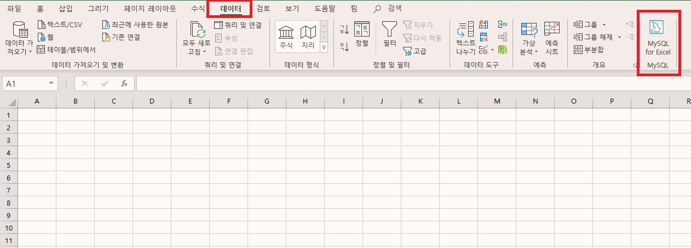
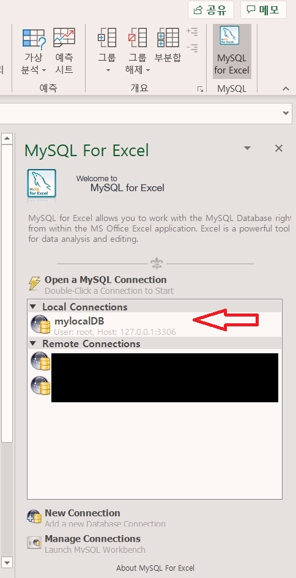
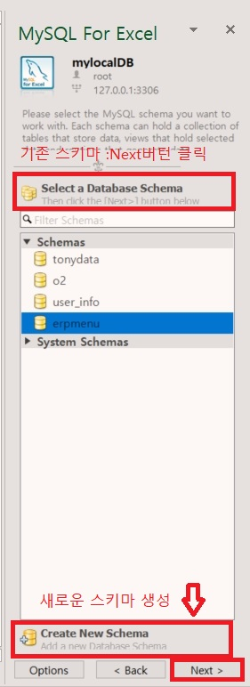
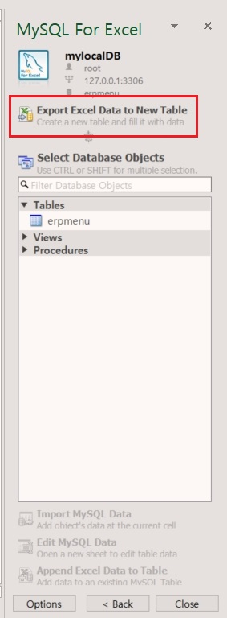
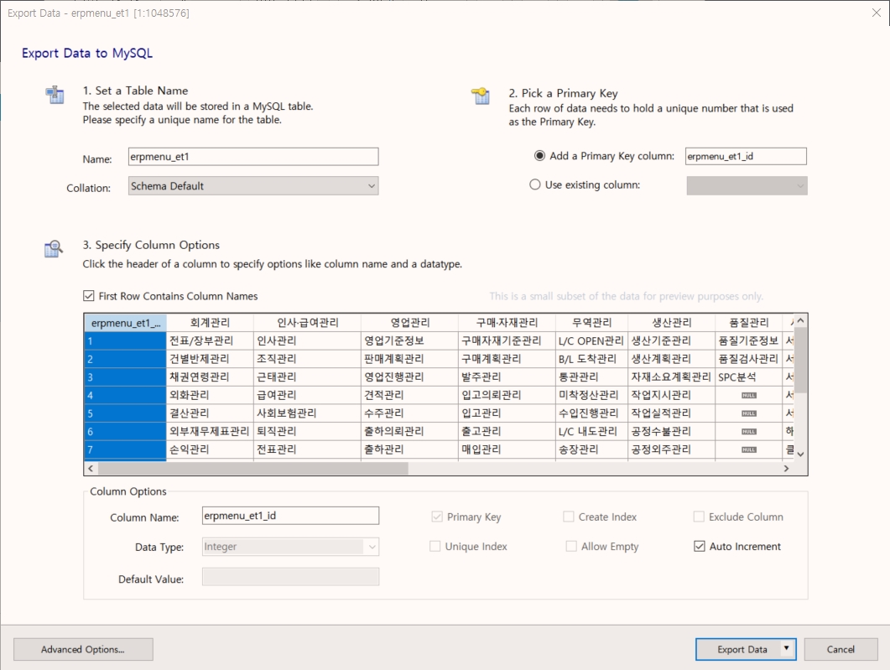
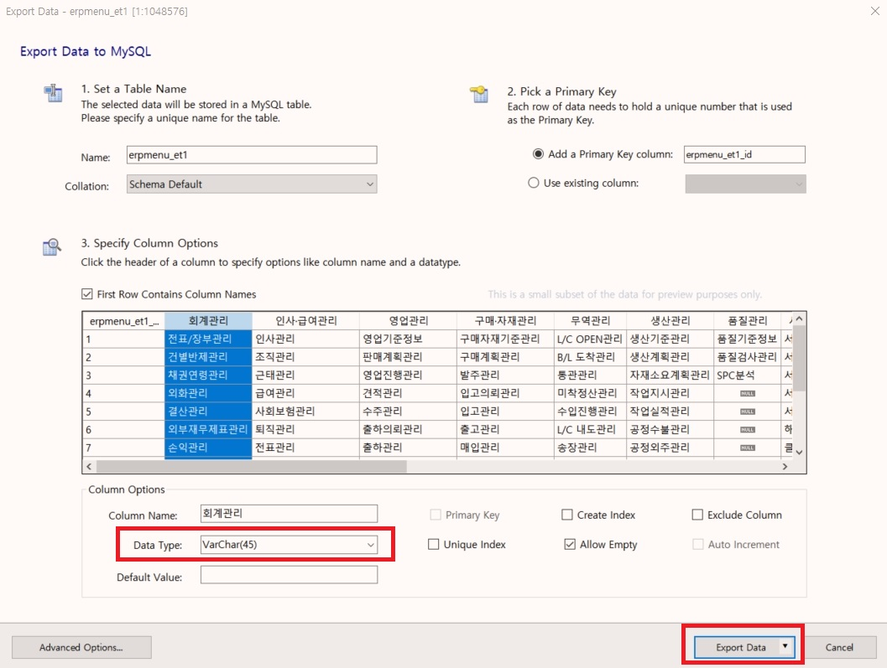
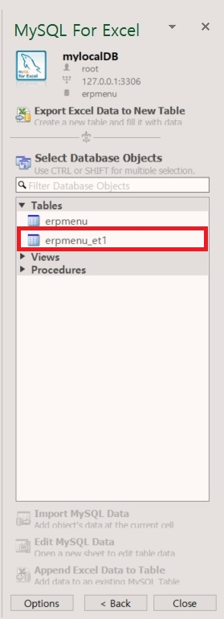

# Excel for Mysql

## 목적

기존에 업무용으로 사용해오던 Excel 자료를 데이터베이스화는 방법으로 Excel의 자료를 자동으로 MySQL로 보낼 수 있는 방법을 찾아봅니다.

## 조사

구글에서 “Excel to MySQL”로 찾아봅니다.  
[Chapter 7 Export Excel Data into MySQL](https://dev.mysql.com/doc/mysql-for-excel/en/mysql-for-excel-export.html)  
[MySQL for Excel 기능 - 뭐지? - 티스토리](https://2ssoosike.tistory.com/257)

“MySQL for Excel” 기능이 Excell2010에 있다는 정보를 확인하고 내가 사용하는 office365에도 쓸 수 있는지 확인하여 봅니다.

“MySQL for Excel 설치” 구글에서 찾아봅니다.  
[MySQL for Excel Guide :: 2 Installation - MySQL](https://dev.mysql.com/doc/mysql-for-excel/en/mysql-for-excel-install.html)  
mysql-installer-community-8.0.19.0.msi 다운받아서 설치했으나 실패함.

버전이 높아서 안되는 것 같아서 다시 검색합니다.  
[Download MySQL for Excel – MySQL](https://dev.mysql.com/downloads/windows/excel/)  
mysql-for-excel-1.3.8.msi 다운받아서 설치했으나 실패함.

“Visual Studio Tools for Office Runtime” 먼저 설치하라고 나옵니다.

“Visual Studio Tools for Office Runtime” 구글에서 찾아봅니다.

[방법: Visual Studio Tools for Office 런타임 재배포 가능 패키지](https://docs.microsoft.com/ko-kr/visualstudio/vsto/how-to-install-the-visual-studio-tools-for-office-runtime-redistributable?view=vs-2019)

    1.NET Framework 4 이상을 설치합니다.
    2. Vstor_redist 를 실행 하 여 Microsoft Visual Studio Tools for Office Runtime를 설치 합니다.

이러한 설치 파일은 [Visual Studio 2010 Tools For Office runtime](https://www.microsoft.com/ko-kr/download/details.aspx?id=48217)에서 다운로드할 수 있습니다.  
vstor_redist.exe 다운 받아서 설치합니다.

## 사용법

참고 문서 1: [MySQL for Excel 기능 - 뭐지? - 티스토리](https://2ssoosike.tistory.com/257)  
참고 문서 2: [Mysql for Excel 사용해보기](https://m.blog.naver.com/PostView.nhn?blogId=good_ray&logNo=221538398631&proxyReferer=https%3A%2F%2Fwww.google.com%2F)  

설치하고 Excel을 열어서 “데이터”를 선택합니다.

위 그림에서처럼 **MySQL for Excel**이 생기면 정상적으로 설치가 완료되었음을 확인할 수 있습니다.

**MySQL for Excel** 버턴을 누르면 기존에 연결되어 있는 데이터베이스가 보입니다.

데이터 베이스와 접속하기 위해서는 나타난 데이터 베이스를 두번 클릭하면 연결됩니다.  
 

새로운 스키마를 만들기 위해서는 “Create New Schema”클릭,  
기존 스키마 사용시 원하는 스키마를 선택하고 “Next”버턴 클릭합니다.

기존 스키마 사용하기 위해서 “Next”버턴 클릭하면

Tabel을 새로 만들기 위해서 “Export Excel Data to New Table” 클릭합니다.

각 칼럼에 대해서 Data Type을 원하는 것으로 변경하고 “Export Data”를 누릅니다.

새로운 테이블이 만들어 집니다.

