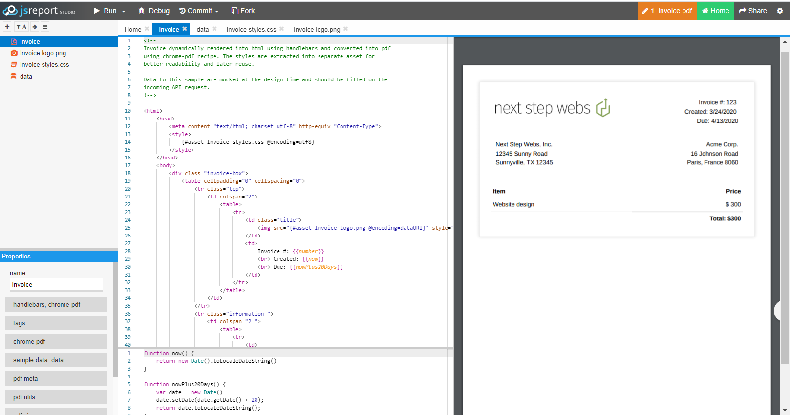
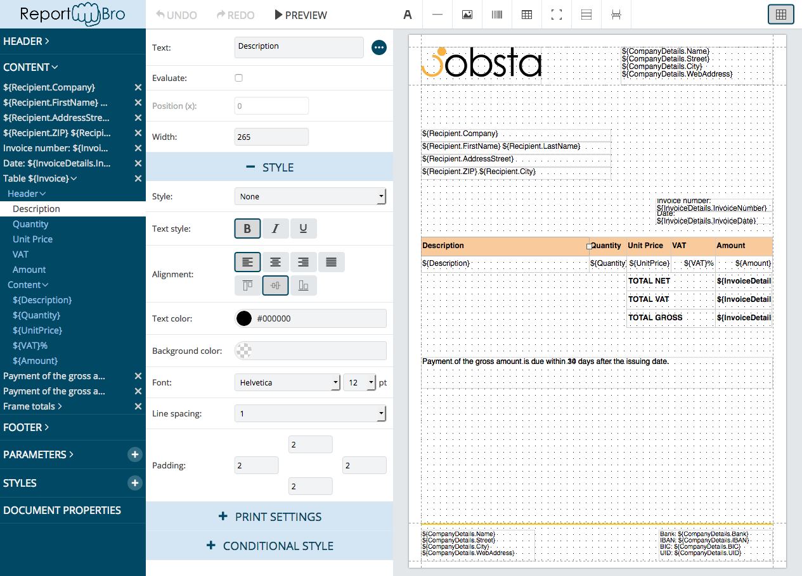
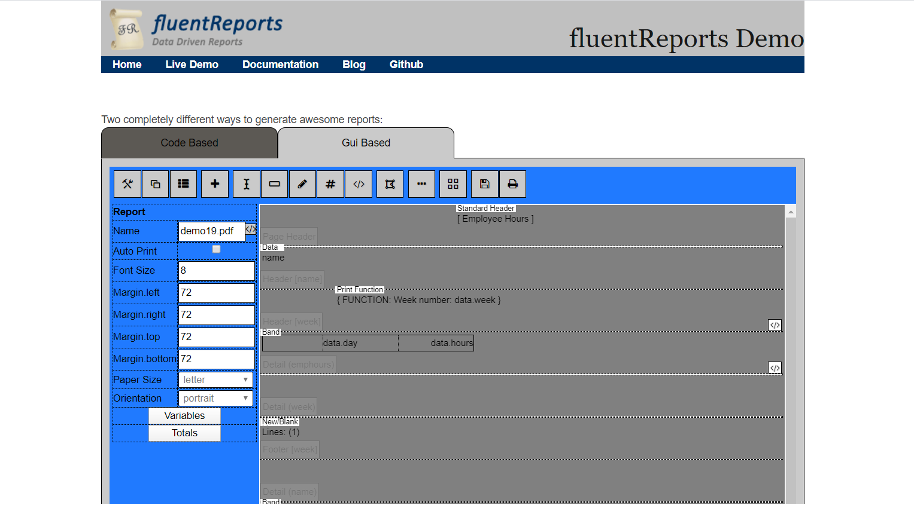
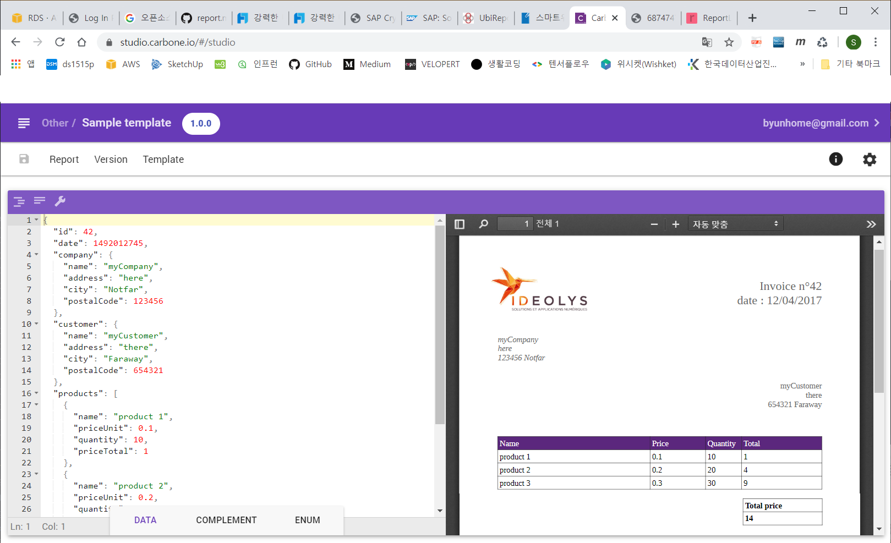
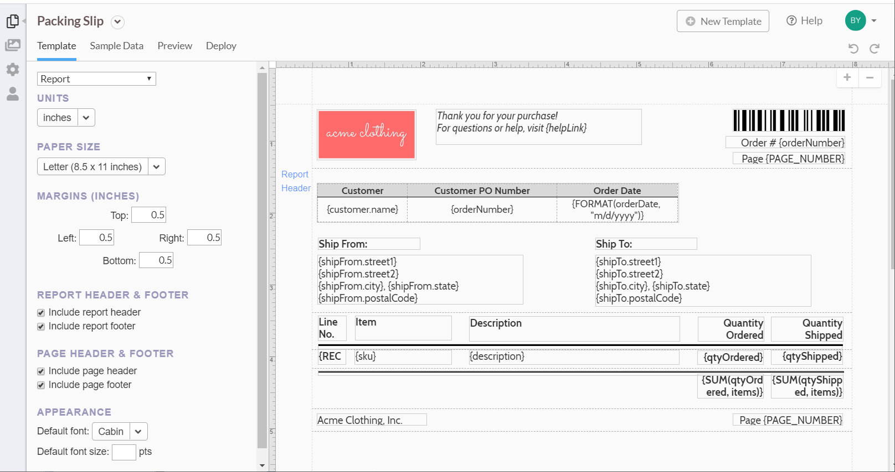
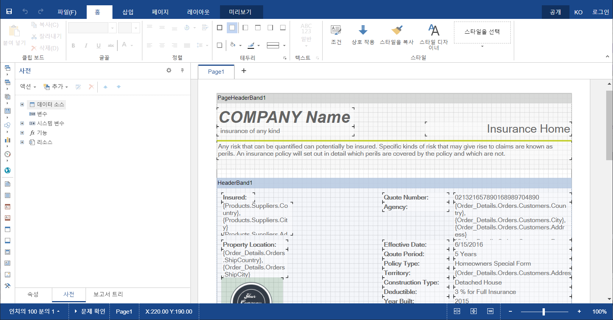

# Reporting Tool

## Reporting Tool이란

웹 리포팅툴은 기업ㆍ공공기관의 DB에 저장돼 있는 데이터를 활용해 각종 차트나 명세서, 발주서 등 보고서 표준양식을 만들어주는 도구다. 즉 인터넷상에서 다양한 양식의 보고서를 어떠한 환경에서도 동일한 양식으로 출력해주는 솔루션이다.

## 검색조건

1.  Javascript 기반
2.  open source
3.  유료이면 가격이 저렴할 것

## 검토한 Javascript기반의 Reporting Tool

**Jsreport**

- open source 또는 유료
- https://jsreport.net
- https://github.com/jsreport/jsreport
- 검토의견

  ```
  다른 기능들은 다 좋은데 Report Designer가 없다.
  HTML coding으로 양식 만들어야한다.
  (Github에 개발한 흔적은 있으나 중단됨.2년전이 마지막 commit)

  ```

  

**Report Bro**

- open source 또는 유료
- https://www.reportbro.com/license/index
- https://github.com/jobsta/reportbro-designer
- 검토의견
  ```
  Designer 있음.그런데
  무료버전에는 데모만 가능(저장기능 없음...내가 못찾았을 수도 ㅠㅠ)
  ```
  

**fluentreports**

- open source
- https://www.fluentreports.com/demo.html
- https://github.com/NathanaelA/fluentreports
- 검토의견

  ```
  Designer 있음.그런데 너무 허접...어찌 사용하는지 모르겠음.

  ```

  

**Carbon**

- open source 또는 유료
- https://carbone.io
- https://github.com/Ideolys/carbone
- 검토의견

  ```
  LibreOffice를 Designer로 사용.
  아직 designer사용법을 잘 모르겠음.
  기본은 coding해야하는 듯이 보임.

  ```

  

**ReportLayer**

- Trial 30days, 유료(아주 비싸다.)
- https://www.jsreports.com/
- 검토의견

  ```
  Designer 잘 되어 있음.
  홈페이지 주소로 보아 Jsreport를 완전 유료버전으로 만들면서 Designer도 개발한것 같음.

  ```

  

**stimulsoft**

- Trial, 유료
- https://www.stimulsoft.com/en/products
- 검토의견

  ```
  유료라 designer도 잘되어 있음.(한글화)
  각종 개발 language 모두 지원.
  Doc 잘되어 있음

  ```

  

### 검토 의견

- Designer 지원이 안되면 양식 만들기가 상당히 곤란하다.
- open source에서는 아직 적당한 Designer를 찾지 못했다.
- 좀 더 검토해보고 마지막으로 유료버전을 검토해야 할 듯하다.

---

아래는 검토대상에서 제외된 reporting Tool 조사 자료 입니다.

## 국산 유료 Reporting Tool

**OZ Report**

- 회사: 포시에스
- http://www.forcs.com/oz-report/
- 커뮤니티 의견
  `-전자문서기능 -지난 23년동안 한국 리포팅&전자문서 시장을 선도하며 한국 시장 점유율 1위를 차지하고 있는 솔루션입니다. -기능적으로 우수하다는 평 -라이센스 비용이 비쌈 -지원이 잘됨`
  **AI Report**
- 회사: 솔비테크
- http://solbitech.com/sub01/sub01_1_1
- 커뮤니티 의견
  ```
  -엔지니어가 친절하다(끝까지 성실히 마무리 해줬다는 평)
  ```

**CLIP (구:Rexpert)**

- 회사: CLIP SOFT
- http://clipsoft.co.kr/wp/clip-report/overview/
- 해외 병원 솔루션 도입 경험 (참고기사: http://www.etnews.com/20170531000207)
- 커뮤니티 의견
  `-지원 잘됨 -사용이 쉽다 -가볍다`
  **CROWNIX Report & ERS (구:리포트디자이너)**
- 회사: 엠투소프트
- http://www.m2soft.co.kr
- 커뮤니티 의견
  ``
  **UBi Report**
- 회사: (주)유비디시전
- https://www.ubireport.com/product/product.jsp
- 커뮤니티 의견
  ```
  -가격은 저렴하나 마이너 하다는 의견
  ```

## 외산 유료 Reporting Tool

**Crystal Report**

- 회사: SAP
- https://www.crystalreports.com/reports
- 커뮤니티 의견

**FineReport**

- 회사: FanRuan Software Co., Ltd.(중국)
- https://www.finereport.com/kr/product
- 커뮤니티 의견
  ```
  IDC 중국 비즈니스 인텔리전스 소프트웨어 시장 추석 회사, 2018”조사에서 SAP를 제치고 14.88%의 시장 점유율로 1위를 차지하며 2년 연속 시장 지위를 계속 유지하고 있습니다.
  ```

## 외산 오픈소스 Reporting Tool

**Birt**

- java 오픈소스 (http://www.eclipse.org/birt/)
- 라이센스: Eclipse Public License (EPL)
- 이클립스 하위 프로젝트
- web 에서 이용시에는 custom taglib 을 이용

```
개발참고
https://www.ibm.com/developerworks/library/ba-birt-viewer-java-webapps/index.html
```

**JasperReports**

- java 오픈소스 (https://community.jaspersoft.com/project/jasperreports-library)
- 라이센스: JasperReports Lib LGPLV3, JasperSoft Studio EPL
- spring 친화적 (https://stackoverflow.com/questions/27532446/how-to-use-jasperreports-with-spring-mvc)
- 최신버전의 Releases 와 커뮤니티 활성화 (Published: 2018-May-31)
- CSV,HTML,PDF,XLS 지원
- 삼성sds의 anyframework 에서 사용
- iRerpot(라이센스:GPL),Jaspersoft Studio(Eclipse) 오픈소스 리포트 디자인 툴이 존재

```
개발참고
-https://www.logicbig.com/tutorials/spring-framework/spring-web-mvc/jasper-report-view.html
-http://www.baeldung.com/spring-jasper
```

**Pentao**

- java 오픈소스 (http://reporting.pentaho.com/)
- 라이센스: Pentaho Reporting LGPL V2.1 (or later)
- 환경설정과 사용방법이 어렵다는 평

```
개발참고

```

**OpenReports**

- java 오픈소스
- 현재 기준 적극적으로 개발되지 않고 있음
- http://oreports.com/

## Birt vs JasperReports vs Pentao

- http://www.innoventsolutions.com/open-source-reporting-review-birt-jasper-pentaho.html
- http://www.innoventsolutions.com/comparison-matrix.html
- http://www.dongwun.com/tc/46

## Conclusion

- 많은 국내 서비스에서 기술지원 용이성 때문에 국산 리포팅툴을 사용하는 것으로 추정
- 1회성 단독 납품이 아니고 솔루션화 했을경우 상용 리포팅툴 비용에 대한 부담
- 오픈소스 사용시 기술지원이 어렵고 라이센스 검토 필요

출처(일부내용 수정):  
https://gist.github.com/warpgate3/29e48449dae023bfa89511c7c2b17b82
