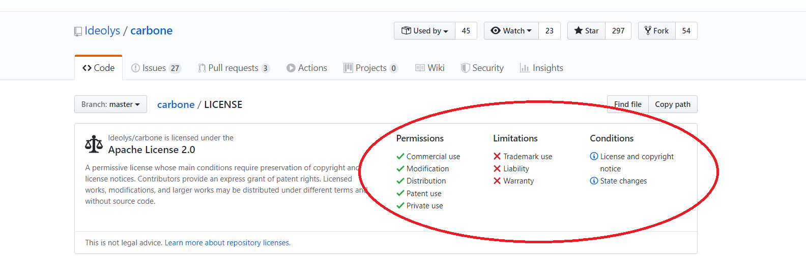

# CARBONE Reporting Tool설치

Jsreport로 테스트하다가 Dsigner가 없는 이유로 결국 다른 Tool을 테스트하여 보았습니다.

**reportBro**

- Designer는 좋은데 Free 버전은 SAVE가 안되는 것 같고 tool을 서버에 올리는 방법도 마땅한 Doc가 없습니다....그래서 포기

**fleuntReport**

- 앞서 말한대로 Designer가 허접해서 사용하기 마땅치 않음...그래서 포기

**Carbone**

- carbone studio에서 PDF문서 발행가능
- MsOffice를 Designer로 사용할수 있다고 되어 있는데 예시가 없어서 잘 모르겠습니다.
- 유료버전도 있어서 어디까지 사용할 수 있는지 명확하지 않습니다.
  https://carbone.io/pricing.html

마지막으로 한번 해보자 마음먹고 **Carbone Report Tool**을 테스트해 봅니다.

---

## Github의 readme를 잘 보고 잘 따라해 봅니다.

https://github.com/Ideolys/carbone

## Github에 확인해 보니 Apache License 2.0입니다.



## Carbone의 특징

- **Extremely simple** : Use only LibreOffice™, OpenOffice™ or Microsoft Office™ to draw your report
- **Unlimited design** : The limit is your document editor: pagination, headers, footers, tables...
- **Convert documents** : thanks to the integrated document converter
- **Unique template engine** : Insert JSON-like markers `{d.companyName}` directly in your document
- **Flexible** : Use any XML documents as a template: docx, odt, ods, xlsx, html, pptx, odp, custom xml files...
- **Future-proof** : A powerful XML-agnostic algorithm understands what to do without knowing XML document specifications
- **Multilingual** : One template, multiple languages. Update translation files automatically
- **Format data** : Use built-in date and number formatters or create your own in Javascript
- **Fast** : Manage multiple LibreOffice threads for document conversion, optimized code generation for each report

## 어떻게 동작하나요?

- Carbone은 mustache와 유사한 template engine이다.  
  ( `{d.companyName}`. 형식으로 파라메타를 전달한다는 의미인 것 같습니다.)

- mustache : https://github.com/mustache/mustache

- Template 언어의 문법 : https://carbone.io/designer-documentation.html

- 템플릿은 LibreOffice ™ 또는 Microsoft Office ™ (ods, docx, odt, xslx ...)에서 제공되는 XML 문서 일 수 있습니다.
- 입력 data는 JSON object or array형식입니다.

- Carbone은 템플릿을 분석하고 문서에 데이터를 주입합니다. 생성 된 문서는 그대로 내보내거나 시스템에 LibreOffice가 설치된 경우 다른 형식 (PDF, ...)으로 변환 할 수 있습니다.  
  **Carbone은 서버 측에서만 작동합니다**

## 최소요구사항

- NodeJS 8.x+
- Runs on OSX, Linux (servers and desktop), and coming soon on Windows

#### 옵션(중요함)

- PDF파일을 만들려면 LibreOffice가 시스템에 설치 되어 있어야 합니다.
- LibreOffice가 없어도 템플릿과 동일한 형식으로 docx, xlsx, pptx, odt, ods, odp, html 파일을 생설할수 있습니다.

## 시작하기

1 - 프로젝트에 install합니다

    npm install carbone

2 - 아래의 코드를 복사하여 새파일을 만들고 node로 실행시킵니다.  
result.odt 파일이 잘 생성되었는지 확인합니다.

```javascript
const fs = require("fs");
const carbone = require("carbone");

// Data to inject
var data = {
  firstname: "John",
  lastname: "Doe"
};

// Generate a report using the sample template provided by carbone module
// This LibreOffice template contains "Hello {d.firstname} {d.lastname} !"
// Of course, you can create your own templates!
carbone.render("./node_modules/carbone/examples/simple.odt", data, function(err, result) {
  if (err) {
    return console.log(err);
  }
  // write the result
  fs.writeFileSync("result.odt", result);
});
```

## PDF 생성, 문서 변환

Carbone은 LibreOffice를 효율적으로 사용하여 문서를 변환합니다. 테스트 된 모든 솔루션 중에서 현재 가장 신뢰할 수 있고 안정적인 솔루션입니다.

### 1 - LibreOffice 설치

**시스템에 설치시**  
https://www.libreoffice.org/ 의 안정적인 버전을 사용하여 LibreOffice를 정상적으로 설치 하십시오.

**우분투 서버 및 우분투 데스크탑에 설치시**

PPA libreoffice / ppa에서 제공하는 LibreOffice는 Python을 번들로 제공하지 않습니다 (Carbon에 필수). 가장 좋은 해결책은 공식 웹 사이트에서 LibreOffice 패키지를 다운로드하여 수동으로 설치하는 것입니다.

```bash
  #LibreOffice의 모든 이전 버전 제거
  sudo apt remove --purge libreoffice *
  sudo apt autoremove --purge

  # LibreOffice 데비안 패키지를 다운로드합니다. OS에 맞는 것을 선택하십시오 (64 비트 또는 32 비트).
  # http://download.documentfoundation.org/libreoffice/stable의 최신 받기
  #또는 현재 "CARBONE 테스트"버전 다운로드 :

  wget https://downloadarchive.documentfoundation.org/libreoffice/old/5.3.2.2/deb/x86_64/LibreOffice_5.3.2.2_Linux_x86-64_deb.tar.gz

  # LibreOffice 5.0+ 의 우분투 서버에 필요한 종속성 설치
  sudo apt install libxinerama1 libfontconfig1 libdbus-glib-1-2 libcairo2 libcups2 libglu1-mesa libsm6

   #패키지 압축 풀기
  tar -zxvf LibreOffice_5.3.2.2_Linux_x86-64_deb.tar.gz
  cd LibreOffice_5.3.2.2_Linux_x86-64_deb / DEBS

  # LibreOffice 설치
  sudo dpkg -i * .deb

  # 보고서에서 Microsoft 글꼴을 사용하려면 글꼴을 설치해야합니다.
  # (Andale Mono, Arial Black, Arial, Comic Sans MS, Courier New, Georgia, Impact,
  # Times New Roman, Trebuchet, Verdana, Webdings)
  sudo apt install ttf-mscorefonts-installer
```

### 2 - PDF 생성

이제 렌더링 방법에 옵션을 주어 converter를 사용할 수 있습니다.  
LibreOffice를 시작해야하므로 첫 번째 변환 만 느리게 시작합니다.  
파일의 내용을 아래와 같이 수정 후 node로 실핼시킵니다.  
result.pdf 파일이 잘 생성되 었는지 확인합니다.

```javascript
var data = {
  firstname: "John",
  lastname: "Doe"
};

var options = {
  convertTo: "pdf" //can be docx, txt, ...
};

carbone.render("./node_modules/carbone/examples/simple.odt", data, options, function(err, result) {
  if (err) return console.log(err);
  fs.writeFileSync("result.pdf", result);
  process.exit(); // to kill automatically LibreOffice workers
});
```

### 3 - PDF변환 테스트시 발생 문제

**시스템에서**

- LibreOffice를 설치후 변환테스트를 하면 Libreoffice가 없다는 메세지가 나올수 있습니다.  
   원인은 PATH설정이 안되어 있어서 입니다.  
   Libreoffice의 실행파일은 C:\Program Files\LibreOffice\program 에 설치되어 있으므로 시스템의 환경변수에
  PATH를 추가하여 주세요.

**우분투 서버에서**

- permission denied 에러  
  PDF파일 변환시 파일을 write해야하는데 폴더의 권한이 RWX가 아니기 때문에 Linux에서 발생하는 에러입니다. 파일을 생성할 폴더의 권한을 RWX(모든권한)로 바꿔 주세요.(구글링필요)

- PDF파일은 생성되는데 한글 폰트가 깨짐  
  리눅스에 한글 폰트를 설치하여 주세요.  
  저는 아래와 같이 설치했습니다.
  ```
  sudo apt install language-pack-ko fonts-nanum
  ```
- 그런데 한글 폰트 설치시 또 아래와 같은 에러가 날 수 있습니다.

  ```
  E: Could not get lock /var/lib/dpkg/lock-frontend - open (11: Resource temporarily unavailable)
  E: Unable to acquire the dpkg frontend lock (/var/lib/dpkg/lock-frontend), is another process using it?
  ```

  아래문서를 참고하여 해결하세요.  
  https://kgu0724.tistory.com/71

- 폰트가 잘 설치되다가 갑자기 팝업창이 뜹니다. 폰트사용 라이선스에 동의하는 것 인데요.그냥 TAB키 누르시고 OK가 선택되면 ENTER하시면 됩니다.  
  https://askubuntu.com/questions/804392/what-is-the-meaning-of-this-microsoft-eula-message
