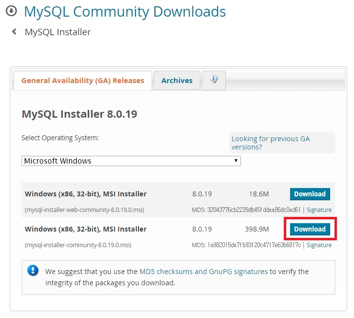
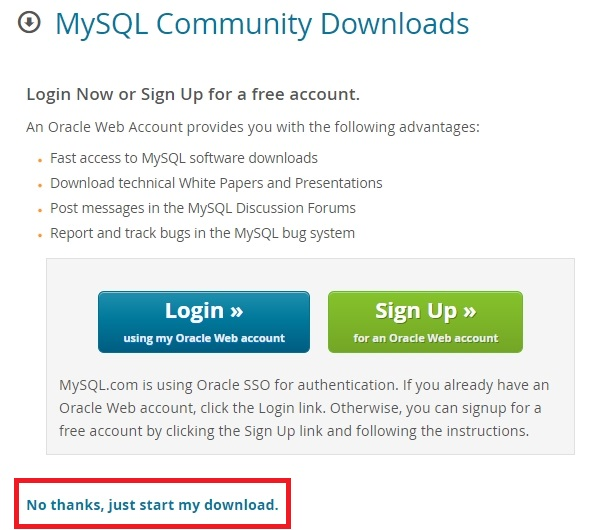
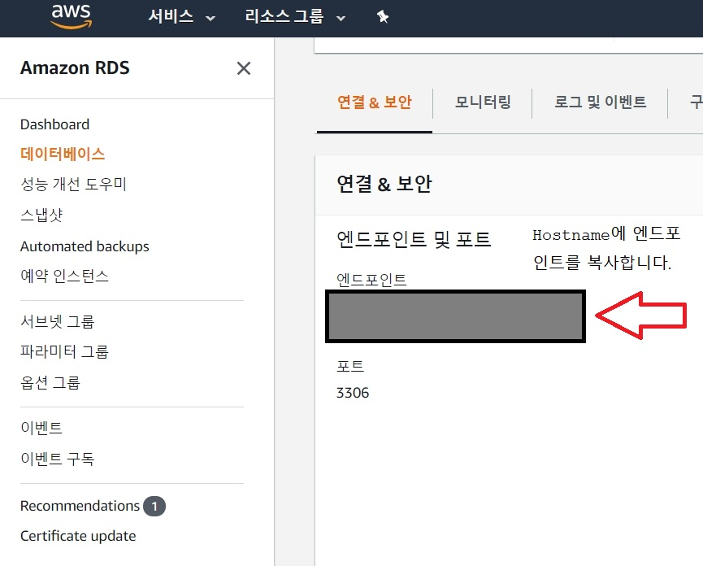
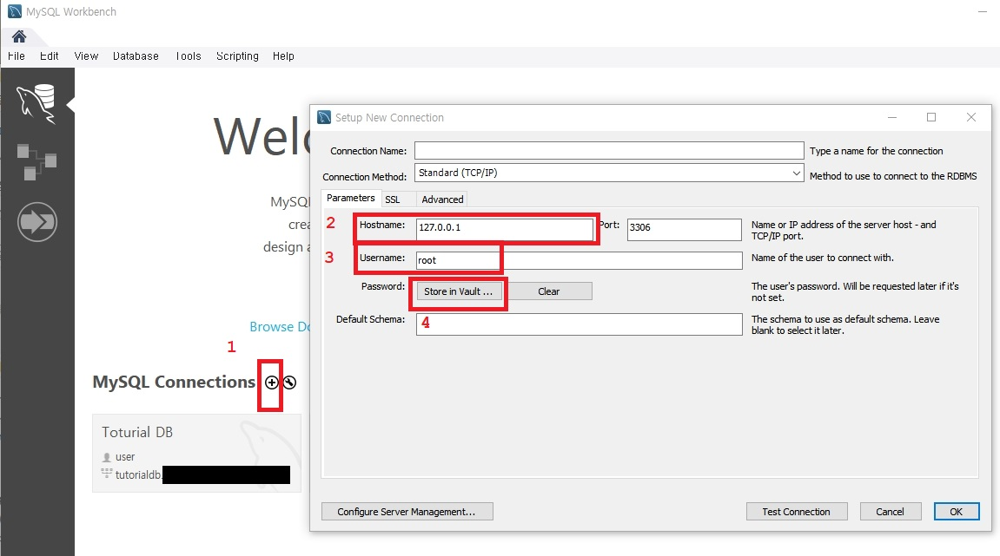

# MySQL Workbench 설치
참조 동영상:
[생활코딩MySQL Workbench](https://opentutorials.org/course/3161/19548)    

참조 사이트:
[MySQL 워크 벤치 매뉴얼](https://dev.mysql.com/doc/workbench/en/wb-installing-windows.html)

## MySQL 설치 프로그램을 사용하여 설치    

[MySQL Installer 다운로드](https://dev.mysql.com/downloads/windows/installer/) 에서 다운로드 할 수 있습니다.
     

    

[**설치하는 방법 참조**](https://dog-developers.tistory.com/20)

MySQL Installer를 실행할 때 설치할 제품 중 하나로 MySQL Workbench를 선택할 수 있습니다.    
기본적으로 선택되며 독립형 MSI Installer 패키지로 실행할수도 있습니다.    

## Windows MSI 설치 관리자 패키지를 사용하여 설치
독립형 다운로드는 https://dev.mysql.com/downloads/workbench/ 에서 사용할 수 있습니다 

## 설치 프로그램 패키지를 사용하여 설치 후 MySQL Workbench 제거
MySQL Workbench를 제거하려면 제어판을 열고 프로그램 추가 / 제거를 선택 하십시오.    
MySQL Workbench 항목을 찾아 제거 버튼을 선택 하십시오 . MySQL Workbench가 제거됩니다.
MySQL Workbench를 제거해도 Workbench 구성 디렉토리는 제거되지 않습니다.    
이 디렉토리에는 MySQL 연결, 구성 설정, 캐시 파일, SQL 스 니펫 및 히스토리, 로그, 사용자 정의 모듈 등이 포함됩니다.    
이 파일들은 사용자의 %AppData% 디렉토리에 저장됩니다 .    
기본적으로 워크 벤치 구성 디렉토리는 C:\username\AppData\Roaming\MySQL\Workbench\    
"C : \ username \ AppData \ Roaming \"이 %AppData%Windows 시스템 변수 의 값입니다. 

## AWS_RDS를 MySQL Workbench에 연결    
     

    

    1.MySQL Connections 옆의 + 를 눌러서 Setup New Connection창을 뛰웁니다.    
    2.AWS RDS의 database를 선택해 [엔드포인트 및 포트] 란의 값을 복사하여 그값을 Hostname에 입력합니다.        
    3.Username : RDS를 만들 때 정했던 [마스터 사용자 이름]을 입력합니다.       
    4.Password : Store in Vault 를 눌러서 RDS를 만들 때 정했던 [마스터 암호]를 입력합니다.    
정보를 모두 입력한 후에는 TestConnection을 클릭해보면 연동이 잘 되는지 확인하실 수 있습니다.    

