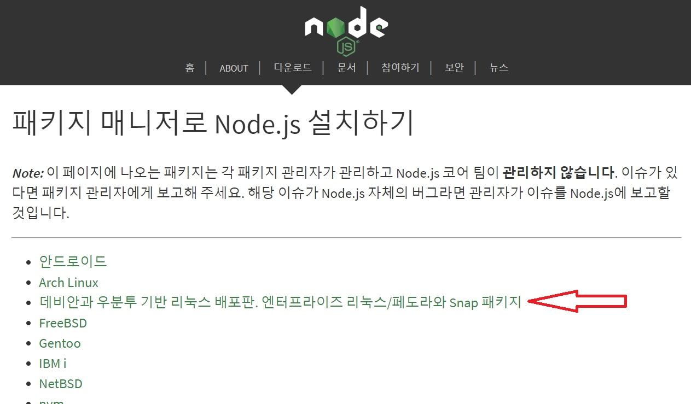

# nodejs 설치

참고 사이트: <https://opentutorials.org/course/2717/11767>

목적
---

nodejs를 실습하기 위한 기본적인 설치 방법을 다룹니다.     
보안과 같은 이슈는 포함하고 있지 않습니다.    
또한 리눅스 배포판인 ubuntu를 기준으로 설명하고 있습니다.    
ubuntu 서버가 없는 분은 EC2를 이용해서 마련할 수 있습니다.

nodejs 설치
----------

위 참고 사이트를 정리하여 최신 버전을 반영하여 아래와 같이 정리하였습니다.

<https://nodejs.org/en/download/package-manager/>

    curl -sL https://deb.nodesource.com/setup_12.x | sudo -E bash -

    sudo apt-get install -y nodejs

디렉토리를 만들고 소유자를 변경합니다. 

이 디렉토리에 프로젝트가 위치합니다. 

    sudo mkdir /opt/o2;

    cd /opt/o2;

    sudo chown ubuntu /opt/o2;

**port 번호가 1024아래 일때는 sudo를 써야합니다.**

npm을 사용하기 위해서 package.json 파일을 만듭니다.

모든 설정을 기본으로 해도 됩니다.(엔터를 누르면 됩니다)

    npm init
    
웹프레임워크인 express를 설치합니다. 

    npm install \--save express
    

아래와 같이 VSCode 에디터를 사용하여 코드를 작성합니다.    
파일명은 app.js

    var express = require(\'express\');    

    var app = express();    

    app.get('/', function(req, res){

    res.send('Hello world');

    });

    app.listen(3000, function(){

    console.log('Connect 3000 port');

    });

아래 명령으로 웹애플리케이션을 구동합니다. 

    sudo node app.js

서버로 접속해봅니다. 

http://localhost:3000/

Hello world

nodejs설치는 여러 방법이 있으므로 구글에서 "우분투에 node js 설치"를    
검색하여 나오는 것 중에서 하나를 선택하여 설치할 수도 있습니다.

예1) <https://kgu0724.tistory.com/69>

예2) <https://nodejs.org/ko/download/>

에서 밑으로 내리면

    

패키지 관리자를 통한 Node.js 설치(Installing Node.js via package
manager) 선택

  

데비안 및 우분투 기반 Linux 배포판, Enterprise Linux / Fedora 및 Snap
패키지

(Debian and Ubuntu based Linux distributions, Enterprise Linux/Fedora
and Snap packages) 선택

예3) \[처음부터 시작하는 EC2\] nodejs 설치    

<https://yuddomack.tistory.com/entry/%EC%B2%98%EC%9D%8C%EB%B6%80%ED%84%B0-%EC%8B%9C%EC%9E%91%ED%95%98%EB%8A%94-EC2-nodejs-%EC%84%A4%EC%B9%98>
