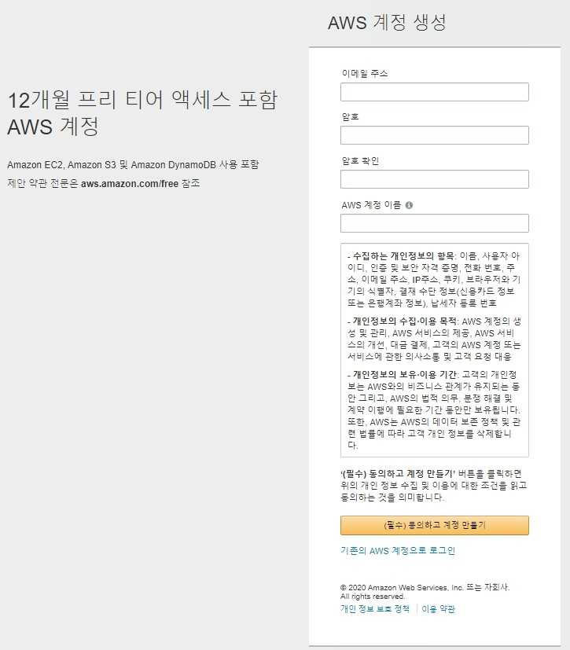
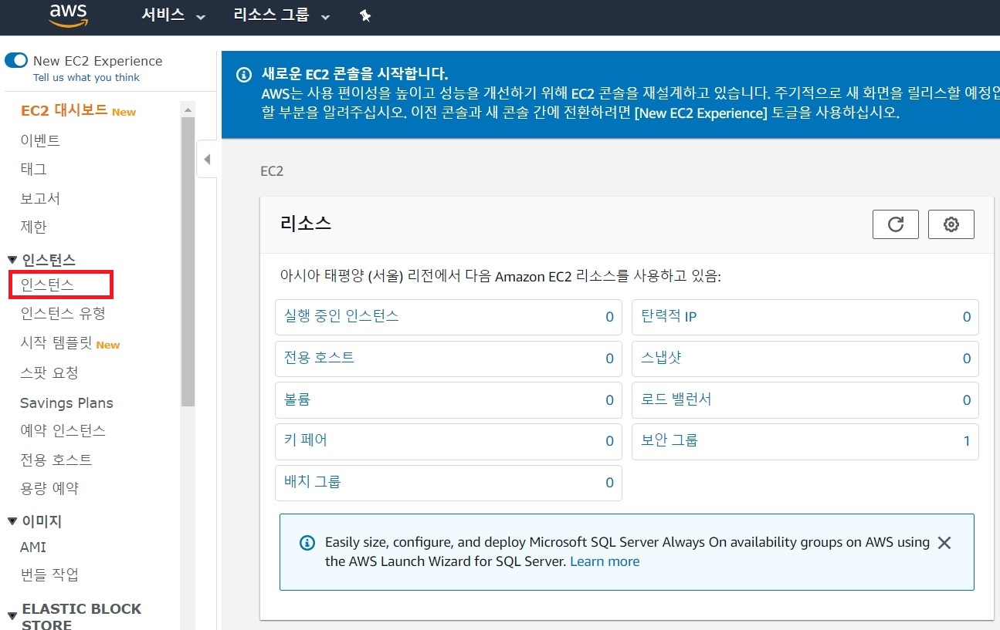
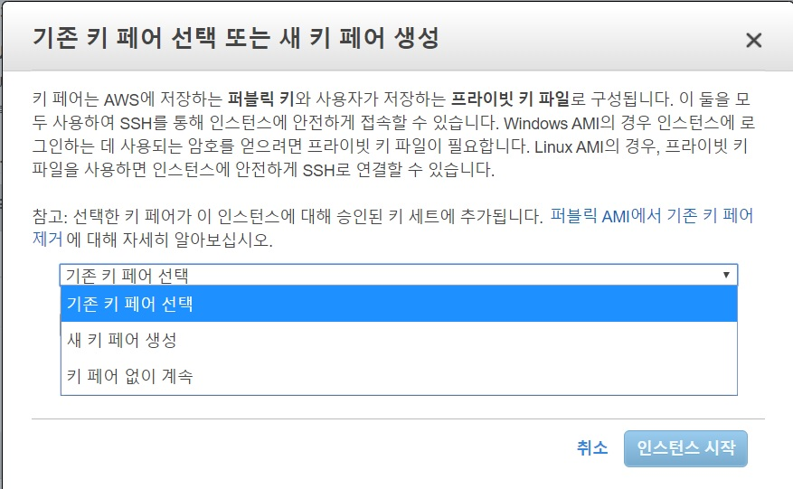
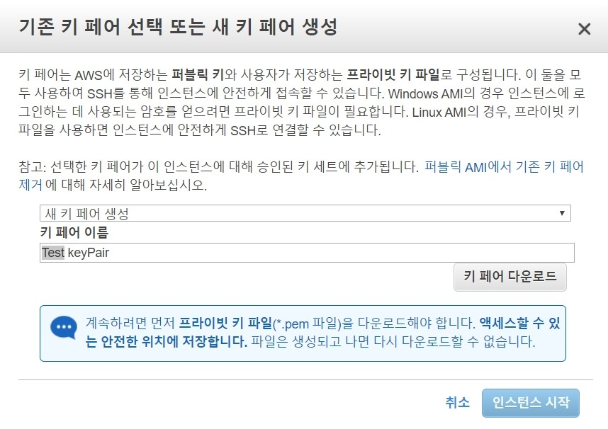
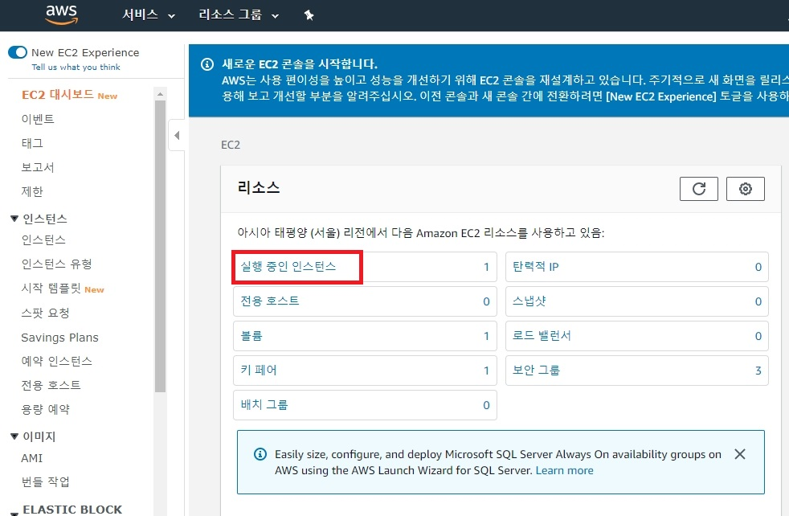
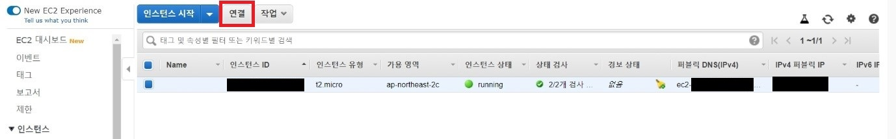
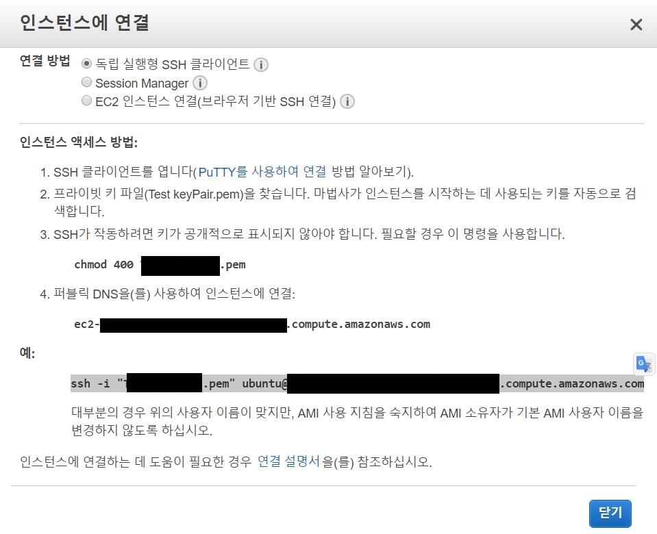

# AWS 서버구축하기

## 목차 

[AWS 계정 생성하기](#aws-계정-생성하기)

[AWS EC2 서버 구축](#aws-ec2-서버-구축)    

AWS 계정 생성하기
================

1-1.아마존 웹 서비스 계정을 만들기 위해 미리 준비해야할 것

    신용카드 혹은 체크카드

    영문 주소

1-2. 아마존 웹 서비스 계정 생성    

아마존 웹 서비스: <https://aws.amazon.com/ko/>

    

무료 계정 만들기로 들어간다.

</img> 
 

참고자료:
<https://www.44bits.io/ko/post/creating-aws-web-service-account>

AWS EC2 서버 구축
===================

참조 문서:

AWS Doc: <https://docs.aws.amazon.com/index.html>

동영상:
<https://www.youtube.com/watch?v=7-zwChaCYzA&list=PLzHsoutbZxp8zShSJ4MkOU68yl--5gLHf&index=3&t=39s>

서비스를 선택한다.    
</img>
     
콘솔 홈을 선택한다    
</img>    
    
서비스 찾기에서 EC2를 입력하고 Enter를 누른다.    

</img>     

위 그림의 **인스턴스**를 누른다.    
    
**지역은 서울로 설정하고 해당 지역에서만 사용한다.**
</img>    
     

그 다음 순서는 아래 문서를 참조바랍니다.    
AWS EC2 인스턴스 생성: <https://ndb796.tistory.com/314?category=1045560>    
(MySQL 서버 설치 및 환경 설정 부터는 읽을 필요없음)    

동작을 정리하면 아래와 같습니다.    

  1. 인스턴스 시작 버튼을 누른다.    

  2. Ubuntu Server 18.04 LTS (HVM), SSD Volume Type - ami-0cd7b0de75f5a35d1를 선택    

  3. t2.micro 인스턴스 유형을 선택하고 검토 및 시작을 누른다.    

  4. “검토 및시작하기” 버턴을 누른다.
    

키 페어 선택화면이 나온다.    

</img> 

**기존 키 페어 선택**에서 **새 키 페어 생성**을 선택한다.

</img> 

키페어 이름을 쓰고 **키페어 다운로드** 버턴을 누른다.    
</img>    

**여기서 주의할 점은  "키페어 이름"에 뛰어쓰기를 하지말고 붙여써야 한다.**    
예) test keyPair(x) testkeyPair(o)   
뛰어쓰기를 하면 AWS EC2 연결할 때 문제가 발생한다. 

**키 페어 파일은 잘 관리해야 한다.**

키 페어 파일을 별도 디렉토리로 이동하고 "인스턴스 시작" 버턴을 누른다.

"인스턴스 시작중"이라고 표시된다.

EC2 대시보드로 가서 **실행 중인 인스턴스**를 누른다.    

</img>        
    

</img> 

Web Server에 접속하기 위해서 **연결** 버턴을 누른다.

</img>

Web Server에 접속하기전에 
**key pair file을 관리자만 사용할 수 있도록 설정한다.**    

key pair file이 존재하는 디렉토리로 이동하여    
key pair file의 속성을 연다.    
보안탭을 열고 고급 버턴을 누른다.    
상속을 처리하지 않도록 상속 사용 안함 버턴을 누른다.   
관리자(admin,system)만 남기고 나머지 제거한다.    

명령프롬프트를 관리자 모드로 연다.

key pair file이 존재하는 디렉토리로 이동하여 인스턴스연결에서 예로 보여준 대로 입력한다.

    ssh -i \"TestkeyPair.pem\" ubuntu\@ec2-.......compute.amazonaws.com

**서버 성공**    

실패 사례)    

    C:\key\AWS>ssh -i "Test keyPair.pem" ubuntu@ec2-1.....compute.amazonaws.com
    Warning: Identity file Test keyPair.pem not accessible: No such file or directory.
    ubuntu@ec2-.....compute.amazonaws.com: Permission denied (publickey).
        
keyPair이름에 뛰어쓰기가 있어서 수정해서 다시 시도합니다.    

    C:\Key\AWS>ssh -i "TestkeyPair……...amazonaws.com
    Welcome to Ubuntu 18.04.3 LTS (GNU/Linux 4.15.0-1057-aws x86_64)
    * Documentation:  https://help.ubuntu.com
    * Management:     https://landscape.canonical.com
    * Support:        https://ubuntu.com/advantage
      System information as of Sun Feb  9 12:44:24 UTC 2020
      System load:  0.0               Processes:           86
      Usage of /:   13.6% of 7.69GB   Users logged in:     0
      Memory usage: 14%               IP address for eth0: .....
      Swap usage:   0%
    0 packages can be updated.
    0 updates are security updates.
    The programs included with the Ubuntu system are free software;
    the exact distribution terms for each program are described in the
    individual files in /usr/share/doc/*/copyright.
    Ubuntu comes with ABSOLUTELY NO WARRANTY, to the extent permitted by
    applicable law.
    To run a command as administrator (user "root"), use "sudo <command>".
    See "man sudo_root" for details.
    ubuntu@ip-:~$    

서버 성공

    ubuntu@ip-:~$ exit    
    logout    

exit를 입력하면 우분투 서버에서 빠져나온다

