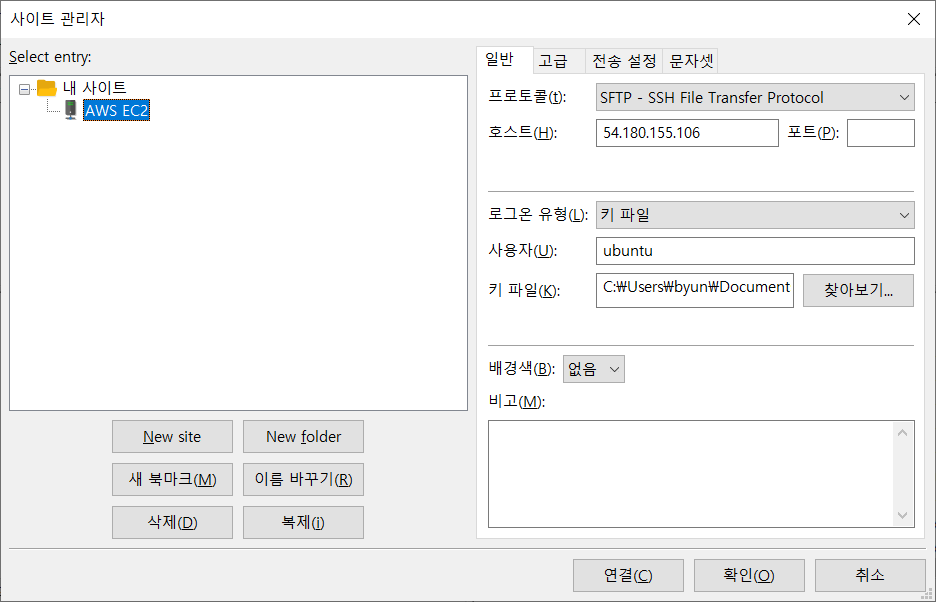

# FileZilla로 웹서버 접속하기

#### 목적:

개발프로그램을 웹서버에 배포시 파일을 웹서버로 전송해야하는데(직접 설치하는 방법도 있음) . 전송 프로그램으로 Filezilla를 사용(이 외에도 winscp등 유사프로 그램이 많음)

#### 설정방법

        1. Filezilla를 pc에 설치
        2. Filezilla 실행후 메뉴에서 파일>사이트관리자 선택
        3. 사이트 관리자에서  왼쪽 아래 New site 버튼을 눌러 사이트를 신규 등록한다.
        4. 왼쪽의 사이트 네임은 원하는대로
        5.  오른쪽의 프로토콜/호스트/로그온유형/사용자는 첨부 그림과 똑같이 설정한다.
        6.  첨부된 키 파일을 pc에 저장하고, 오른쪽 키파일 항목에 등록한다.
        7. 연결 버튼을 눌러 웹서버에 접속한다.
        8. 원하는 파일을 서버에 저장한다.

