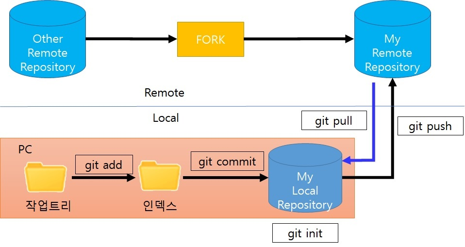

# Git 사용법 

 

# git으로 github로 file을 올릴 때 사용하는 명령어 순서

|순서|git 명령어                      | 설명                                        |
|----|-------------------------------|---------------------------------------------|
|1   |git status                     | 현재 git 상태 보기                           |
|2   |git pull origin master         | Remote저장소 변경 사항을 클라이언트로 내려받음 |
|3   |git add -A                     | 타임 캡슐에 담음                             |
|4   |git commit -m \"First Commit\" | 타임 캡슐에 묻음                             |
|5   |git log                        | 현재까지 Commit된 목록 들을 확인한다.         |
|6   |git push origin master         | 원격 저장소로 commit 내용 올리기              |

명령어 창에서 위와 같은 순서로 명령어를 입력한다.    
git push하기 전에 git pull를 먼저 하지않았을때 github의 내용이 로컬 저장소(내 pc)와 같지않으면   
에러가 발생하고 git pull을 먼저하라는 메세지가 표시된다.

Git 사용법에 대하여 자세한 사항은 아래 참고 site를 살펴보시기 바랍니다.    

### 참고 site:

<https://tagilog.tistory.com/377>    
<https://backlog.com/git-tutorial/kr/intro/intro1_1.html>

### 자주 사용하는 Git 명령

| 설명                              | 명령어                           |
|-----------------------------------|-----------------------------------------------|
| 설정- user.name                    | git config \--global user.name\"John Doe\"    |
| 설정- user.email                   | git config \--global user.email\johndoe\@example.com |
| 저장소 생성                         | git init                         |
| 인덱스에 파일 추가                   | git add filename                 |
| 인덱스에 모든 파일 추가              | git add -A                       |
| 저장소에 변경 내용의 반영            | git commit -m "massage"          |
| 리모트 저장소로 push                 | git push origin master           |
| 리모트 저장소 상태 확인               | git remote -v                    |
| 저장소에서 파일 가져오기              | git fetch \<저장소 url\>         |
| 저장소 상태 확인                      | git status                       |
| 모든 리모트 브랜치와 그 정보를 보여줌  | git remote show origin           |
| 커밋 로그를 표시                      | git log                          |
| remote에서 최신 코드 받아와 merge하기     | git pull                         |
| 저장소 복제하기                           | git clone \<저장소 url\>            |
| 새로운 원격 저장소 추가하기               | git remote add \<원격 저장소\> \<저장소 url\>|
|                                  | git remote add pb https://github.com/paul/tic.git |
| 리모트 저장소 이름을 바꾸기      | git remote rename pb paul        |
| 전역 설정 정보 조회              | git config - -global - -list     |
| 저장소별 설정 정보 조회          | git config - -list               |
| 원격저장소의 브랜치 리스트를 봄  | git branch -r                    |
| 모든 브랜치의 리스트를 봄        | git branch -a                    |
| git add 취소                     | git rest HEAD\[파일명\]          |
| git add한 모든 파일을 취소       | git reset                         |

