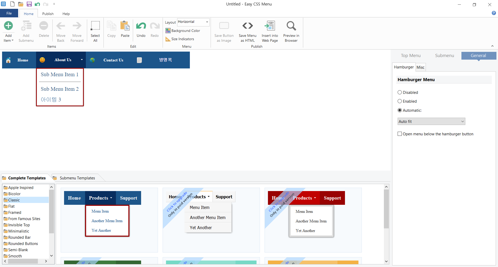

# Menu Builder 분석

## Menu Builder가 필요한 이유

ERP 나 그룹웨어를 개발할 때 반드시 필요한 구성 요소중의 하나가 Menu이다.  
Menu를 보기 좋고 사용자가 편리하게 사용할 수 있도록 꾸미는 일은 개발자 들에겐 여간 번거롭고 힘든 작업이 아니다.
시중에 수많은 Menu Builder 들이 상품화되어 판매되고 있는 현상이 이것을 반증해준다.

개발자들이 힘들어 하는 작업을 좀 더 쉽게 작업할 수 있도록 도와주고 반면에 훌륭한 출력물을 얻을 수 있게 해주는 것이 Menu Builder이다.

## 어떤 Menu Builder를 선택할 것인가?

#### Menu Builder 검색

1차적으로 Menu Builder를 검색하였다.  
 <https://github.com/saeamus/zeror-p1/blob/master/Doc/menuBarMaker.md>

#### 선택 조건 :

1. 가능하면 open source 프로 그램 중에서 선택한다.
2. 편리성과 기능면에서 어느 정도 만족해야한다.
3. 상업적 용도로 사용시 비용이 적은 것을 선택한다.

#### 검토중인 프로그램(더 좋은 것이 발견되면 알려주세요...^^)

1. Drop Down Menus \| Online Generator

   <https://www.dropdownmenugenerator.com/>

   

   특징:  
   14 일 무료, 정식버전은 3가지 플랜 1년에 $10,$20,\$60  
   Online 버전이라 인터넷만 연결되면 어디서든 사용가능.  
   사용하기 편리하다(메뉴작성작업이 직관적이고 편리함).  
   출력물은 단 2줄의 코드로 Script파일을 링크형식으로 HTML코드에 삽입하는 방식이라 View파일의 적당한 곳에 사용자가 넣어야함.
   (소스 전체를 다운 받아 사용할 수도 있고, Online Link도 제공)

   단점:  
   MenuBuilder에서 작성한 파일에 새로운 메뉴를 추가하려면 Menu Builder에서 다시 작업한후 새로운 스크립트를 만들어야한다.  
   즉, HTML 코드상에서 메뉴추가/삭제등 직접 수정이 안된다.

2. Easy CSS Menu

   <https://www.easycssmenu.com/>

   

   특징:  
   Free 버전 있음. 정식 버전은 \$30부터 다양한 플랜이 있다.  
   다운로드 버전이다.  
   사용하기 편리하다.UI 방식은 DropDown Menu랑 전혀 다르지만 직관적이고 편리하게 되어있음.  
   Free 버전은 템플릿 사용에 제한이 있음.(당연한 거죠...ㅋ)  
   출력물은 HTML 코드로 HTML 페이지를 새로 만들 수도 있고,
   기존 View 파일에 삽입할 수도 있음.  
   HTML코드로 출력되기때문에 사용자가 View파일상에서 HTML 코드를 수정하여 직접 메뉴 추가/삭제가 가능하다.

#### 결론

<U>2번 Easy CSS Menu를 선택한다.</U>  
이유:  
사용자에 따라 UI가 조금 불편할 수도 있다는 점, Free버전은 다양한 템플릿이 제공되지 않는다는 점 외에는 기간제한 없는 free버전이 있고, 나름 직관적이고 편리한 UI를 가졌으며, 무엇보다도 HTML 코드로 출력되므로 추후 메뉴 추가 삭제시 간단하게 소스코드 수정만으로 작업이 가능하다.  
즉, 유지보수가 편리한 것이 가장 큰 이유이다.

## Menu Builder를 어떻게 활용할 것인가?

1. 당연한 이유로 Menu를 만드는데 사용한다.(View 파일 작성)
2. 출력된 메뉴파일로 부터 Crawling기법으로 각 Menu Item을 추출한다.
3. 추출된 Menu Item을 DB에 저장한다.
4. DB에 저장된 Menu Item을 추후 메뉴별 권한 설정등에 활용한다.

### Menu Builder에 대한 개인적인 분석입니다.의견이 있으시면 Comment를 달아 주시기 바랍니다.어떠한 의견도 좋습니다.^^
