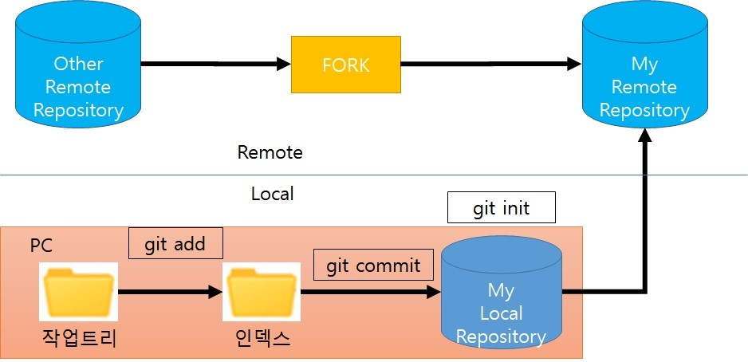
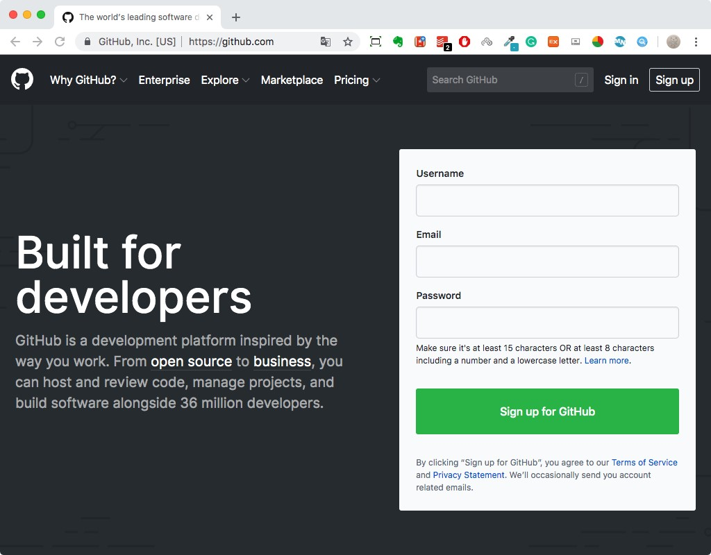
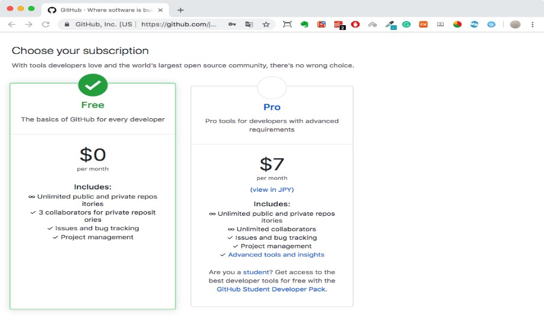
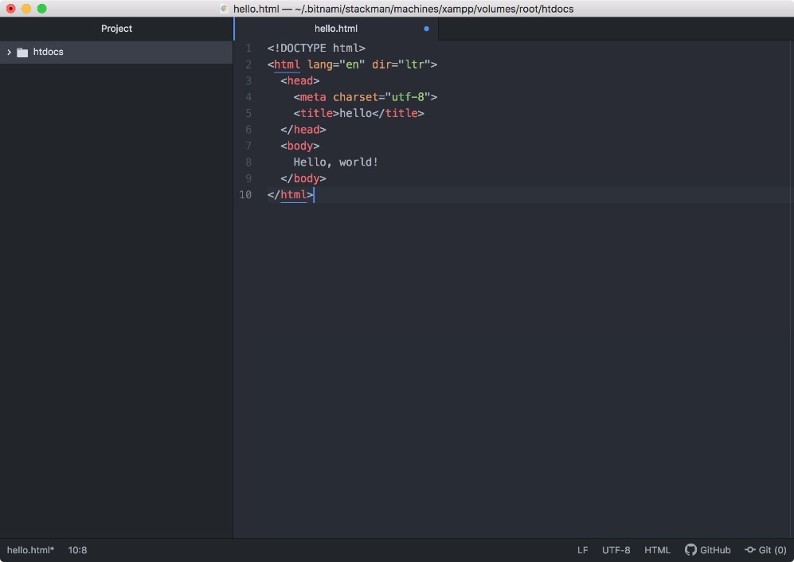

# Github / Git 사용법 

 

# git으로 github으로 file을 올릴 때 사용하는 명령어

| git 명령어                     | 설명                                           |
|--------------------------------|------------------------------------------------|
| git status                     | 현재 git 상태 보기                             |
| git pull origin master         | Remote저장소 변경 사항을 클라이언트로 내려받음 |
| git add -A                     | 타임 캡슐에 담음                               |
| git commit -m \"First Commit\" | 타임 캡슐에 묻음                               |
| git log                        | 현재까지 Commit된 목록 들을 확인한다.          |
| git push origin master         | 원격 저장소로 commit 내용 올리기               |

참고 site:

<https://tagilog.tistory.com/377>

<https://backlog.com/git-tutorial/kr/intro/intro1_1.html>

목차 
====

<ul>
  <li>
    <a href="#github_git"> GitHub / Git </a>
  </li>
  
[Git의 기본 개념 알기](#git의-기본-개념-알기)
  

> [Git 저장소(Git repository) ](#git-저장소git-repository)
>
> [저장소 만들기 ](#저장소-만들기)
>
> [변경을 기록하는 커밋 ](#변경을-기록하는-커밋)
>
> [작업 트리(Work tree)와 인덱스(Index)](#작업-트리work-tree와-인덱스index)
>
> [브랜치 (branch) ](#브랜치-branch)

[GitHub 계정 등록 ](#github-계정-등록)

[Git 설치 ](#git-설치)

> [윈도우버전 Git설치하기 ](#윈도우버전-git설치하기)
>
> [GitHub 사용법 ](#github-사용법)
>
> [GitHub에 저장소 작성 ](#github에-저장소-작성)
>
> [파일의 작성, 편집 ](#파일의-작성-편집)
>
> [파일의 생성 / 변경 / 삭제 git 인덱스에 추가 (git add)](#파일의-생성-변경-삭제-git-인덱스에-추가-git-add)
>
> [변경 결과를 로컬 저장소에 커밋 (git commit)](#변경-결과를-로컬-저장소에-커밋-git-commit)
>
> [로컬 저장소를 밀어 원격 저장소에 반영 (git push)](#로컬-저장소를-밀어-원격-저장소에-반영-git-push)
>
> [브랜치 (branch) 사용 ](#브랜치-branch-사용)
>
> [브랜치의 생성, 이동 ](#브랜치의-생성-이동)
>
> [브랜치에서의 개발 작업 ](#브랜치에서의-개발-작업)
>
> [브랜치에 푸시 ](#브랜치에-푸시)
>
> [브랜치에서 풀 ](#브랜치에서-풀)
>
> [브랜치 병합 ](#브랜치-병합)
>
> [브랜치 삭제 ](#브랜치-삭제)
>
> [자주 사용하는 Git 명령 ](#자주-사용하는-git-명령)

</ul>

<h1 id="github_git">
  GitHub / Git 
</h1>

**GitHub는 소프트웨어 개발 프로젝트를 위한 소스코드 관리 서비스**입니다.
소스 코드를 열람하고 간단한 버그 관리, SNS 기능까지 갖추고 있어
개발자에게 없어서는 안될 서비스입니다. GitHub를 사용하여 버전 관리를
실시하고 있는 기업도 다수 있습니다.

**Git은 버전관리 툴입니다.**

Git이란 소스코드를 효과적으로 관리하기 위해 개발된 \'분산형 버전 관리
시스템\'입니다. 원래는 Linux 소스코드를 관리할 목적으로 개발되었습니다.

Git에서는 소스 코드가 변경된 이력을 쉽게 확인할 수 있고, 특정 시점에
저장된 버전과 비교하거나 특정 시점으로 되돌아갈 수도 있습니다.

또 내가 올리려는 파일이 누군가 편집한 내용과 충돌한다면, 서버에 업로드
할 때 경고 메시지가 발생됩니다.

Git의 기본 개념 알기
===================

Git 저장소(Git repository)
--------------------------

**저장소(Git repository)란 말그대로 파일이나 폴더를 저장해 두는
곳**입니다. 그런데 Git 저장소가 제공하는 좋은 점 중 하나는 파일이 변경
이력 별로 구분되어 저장된다는 점입니다. 비슷한 파일이라도 실제 내용 일부
문구가 서로 다르면 다른 파일로 인식하기 때문에 파일을 변경 사항 별로
구분해 저장할 수 있습니다.

Git은 원격 저장소와 로컬 저장소 두 종류의 저장소를 제공합니다.

-   원격 저장소(Remote Repository): 파일이 원격 저장소 전용 서버에서
    > 관리되며 여러 사람이 함께 공유하기 위한 저장소입니다.

-   로컬 저장소(Local Repository): 내 PC에 파일이 저장되는 개인 전용
    > 저장소입니다.

저장소 만들기
-------------

내 컴퓨터에 로컬 저장소를 만드는 방법은 두 가지가 있습니다.

첫 번째, 아예 저장소를 새로 만들거나, 두번째, 이미 만들어져 있는 원격
저장소를 로컬 저장소로 복사해 올 수 있습니다.

변경을 기록하는 커밋
--------------------

파일 및 폴더의 추가/변경 사항을 저장소에 기록하려면 \'커밋\'을 실행해야
합니다.

커밋 (commit) : 파일을 추가하거나 변경 내용을 저장소에 저장하는 작업

커밋 실행하면 이전 커밋 상태부터 현재 상태까지의 변경 이력이 기록된
커밋(혹은 리비전)이 만들어집니다.

각 커밋에는 영문/숫자로 이루어진 40자리 고유 이름이 붙습니다. 저장소에선
이 40자리 이름을 보고 각 커밋을 구분하고 선택합니다.

커밋은 이렇게 이력을 남기는 중요한 작업이기 때문에 커밋을 실행할 땐
**커밋 메시지**를 필수로 입력해야 합니다. 메시지가 없으면 커밋이
실행되지 않습니다.

푸시 (push) : 파일을 추가하거나 변경 내용을 원격 저장소에 업로드 하는
작업

작업 트리(Work tree)와 인덱스(Index)
------------------------------------

Git 에서는 우리가 흔히 말하는 폴더를 \'작업 트리\'(Work Tree)라고
부릅니다.

그리고 커밋을 실행하기 전의 저장소와 작업 트리 사이에 존재하는 공간을
\'인덱스\'라고 합니다

Git의 \'커밋\' 작업은 \'작업 트리\'에 있는 변경 내용을 저장소에 바로
기록하는 것이 아니라 그 사이 공간인 \'인덱스\'에 파일 상태를 기록(stage
- 스테이징 한다고 표현하기도 합니다)하게 되어 있습니다. 따라서 저장소에
변경 사항을 기록하기 위해서는, 기록하고자 하는 모든 변경 사항들이
\'인덱스\'에 존재해야 합니다.

**git add** : 파일의 생성 / 변경 / 삭제를 git 인덱스에 추가

브랜치 (branch)
---------------

소프트웨어 개발은 ​​현재 출시하고 있는 버전의 유지 보수를 하면서 새로운
기능 추가 및 버그 수정을 할 수 있습니다. 이러한 병렬로 수행되는 여러
버전 관리를 위해 Github에는 브랜치 (branch)라는 기능이 있습니다.

지점은 역사의 흐름을 분기하여 기록해 나가는 것입니다. 분기 한 지점은
다른 지점의 영향을 받지 않기 때문에 같은 저장소에서 각 개발을 해 나갈 수
있습니다.

GitHub 계정 등록
================

사용을 위해 GitHub에 가입해 봅시다. 우선, [GitHub의
페이지](https://github.com/) 에 액세스합니다. 그리고 사용자 이름과
이메일 주소, 비밀번호를 입력하여 계정 등록을 합니다.

 이어서 나오는 유형중 무료로 사용할 수 있는 Free 플랜을 선택한 후
\"Finish sign up\" 버튼을 클릭합니다.

등록한 메일 주소로 인증 메일이 도착합니다. 메일 내용에 따라 사용자
인증을 수행하면, GitHub 계정 등록이 완료됩니다.

Git 설치
========

윈도우버전 Git설치하기
----------------------

Git 설치파일을 다운로드 받습니다.

[Git다운로드 링크 바로가기](https://git-scm.com/downloads)

위에 링크되어 있는 페이지에 들어가서 자신의 OS에 맞는 Git 설치버전을
받아주세요.

참조

<https://coding-factory.tistory.com/245>

설치 완료 후에 설치받은 **GitBash**를 열어서

\$git config \--global user.name \" 깃허브 아이디\"

\$git config \--global user.email \" 깃허브에서 사용한 메일주소\"

위의 명령어를 쳐 설정을 해줍시다. 

\$git config \--list

위의 명령어를 입력하여 Name과 Email이 제대로 들어갔는지 확인할 수
있습니다.

<!--  -->
</img> 

GitHub 사용법
-------------

기본적으로 작은 작업 단위로 커밋을 하고, 어느 정도 작업이 일단락했을 때
푸시를 하는 것이 일반적입니다. 커밋 작업이 알기 쉽게 커밋 메시지를
남겨두면 로그를 따라가는 때 도움이 됩니다.

  1.Github에 저장소 작성 (**git init**) 또는 복제 (**git clone**)

  2.파일의 작성, 편집

  3.파일의 생성 / 변경 / 삭제를 git 인덱스에 추가 (**git add**)

  4.변경 결과를 로컬 저장소에 커밋 (**git commit**)

  5.로컬 저장소를 푸쉬해 원격 저장소에 반영 (**git push**)

 

GitHub에 저장소 작성
--------------------

GitHub의 메인 화면에서라면, **Create New Repository** 버튼을 클릭합니다.

위 화면에서 **Repository name**에 이름을 입력 후 필요에 따라
Description에 저장소의 설명을 입력합니다. 그리고 저장소 유형에는
**\"Public\"**을 선택합니다. 

프라이빗(private) 리포지토리는 리포지토리 소유자 및 공동 작업자만 볼 수
있습니다.

퍼블릭(Public) 리포지토리는 전 세계 누구나 접근할 수 있어 코드 공개를
원하지 않는 개발자는 유료 결제를 해 프라이빗 리포지토리를 사용하거나,
다른 서비스를 사용해야 했습니다. 깃허브에서 프라이빗 리포지토리를
사용하려면 월 7달러를 내고 깃허브 프로(Github Pro)로 업그레이드해야
합니다.

**2019년 1월 7일부터 비공개 저장소 (Private Repository)를 유료 결제없이
무제한으로 사용할 수 있도록 무료플랜 정책이 변경되었습니다.** 하지만
협업할 수 있는 collaborators는 3명까지만 가능합니다. 여러 명이 작업을
하는 경우 상용버전인 프로(Pro)버전을 사용해야합니다.

깃허브와 비슷한 서비스 **비트버킷(Bitbucket)**은 5인 무료,
**깃랩(Gitlab)**은 무제한 인원 무료로 프라이빗 리포지토리를 제공합니다.

마지막으로, 저장소에 미리 README 파일을 만들어 놓는 경우는 \"Initialize
this repository with a README\"에 체크합니다. .gitignore이나 license에
대해서는 나중에 추가하거나 변경할 수 있으므로 None을 선택합니다. 필요
항목의 입력이 끝나고 Create repository 버튼을 클릭하면 저장소 생성이
완료됩니다.

 

파일의 작성, 편집
-----------------

이번에는 \"hello.html\" 파일을 로컬 PC에 생성해서 진행을 해
보겠습니다. HTML 파일을 만듭니다.

그럼 가지고 계신 PC에 먼저 로컬 저장소를 만듭니다. 먼저
적당히 \'helloworld\'라는 디렉토리를 만들 수 있습니다.

mkdir helloworld

cd helloworld

git init

\"mkdir\"은 새로운 디렉토리를 만드는 명령 \"cd\"는 디렉토리를 이동하는
명령입니다. helloworld라는 디렉토리를 만들고 그 디렉토리로 이동한 후
작업을 시작합니다.

그리고 이 **git init 명령은 Git 저장소를 새로 만드는 명령입니다**. 이
명령을 실행하면 현재 디렉토리를 Git 저장소로 변환합니다. .git 디렉토리가
생성됩니다.

파일의 생성 / 변경 / 삭제 git 인덱스에 추가 (git add)
-----------------------------------------------------

방금 만든 \"hello.html\"파일을 로컬 저장소에 추가합시다. 그리고 다음의
명령으로 인덱스에 추가합니다. 인덱스는 저장소에 커밋 할 준비를 하기 위해
변경 내용을 임시로 저장할 위치입니다.

git add hello.html

 

변경 결과를 로컬 저장소에 커밋 (git commit)
-------------------------------------------

다음으로 인덱스에 추가된 파일을 커밋합니다. 커밋은 파일이나 디렉토리의
추가 또는 변경을 저장소에 기록하는 작업입니다.

git commit -m \"First Commit\"

이제 저장소에 파일 추가가 기록되었습니다. 파일이 추가되어 있는지
확인합니다.

git status

또한 원격 저장소에 반영하기 전에 원격 저장소의 정보를 추가합니다. 이
정보는 방금 GitHub에 표시된 원격 저장소의 주소입니다. 이번에는 예를
보여줍니다.

git remote add origin https://github.com/username/repositaryName

 

로컬 저장소를 밀어 원격 저장소에 반영 (git push)
------------------------------------------------

로컬 저장소의 변경 사항을 GitHub에있는 원격 저장소에 반영하기 위해 다음
명령을 실행합니다.

git push origin master

GitHub의 사용자 이름과 암호를 입력하면, GitHub에 푸시하고 원격 저장소에
반영할 수 있습니다. 작업이 끝났으면 github.com페이지로 가서 파일이 잘
푸쉬가 됐는지 확인합니다.

 

브랜치 (branch) 사용
--------------------

이제 기본적인 사용법은 알아봤으니,  실제 코딩 때 자주 이용되는 브랜치
(branch)의 사용법에 대해 살펴보겠습니다.

사전 지식에서도 소개했지만 분기는 동시에 이루어지는 여러 버전 관리를 할
수 있는 구조입니다. 기본적으로 다음과 같은 순서로 사용합니다.

브랜치의 생성, 이동

브랜치에서의 개발 작업

브랜치에 푸시

브랜치에서 풀

브랜치 병합

브랜치 삭제

브랜치의 생성, 이동
-------------------

우선 현재 브랜치 목록을 살펴봅니다.

git branch

실행 결과는 다음과 같습니다. 

\* master 

옵션을 지정하지 않고 branch 명령어를 실행하면 브랜치 목록 전체를 확인할
수 있습니다. 앞 부분에 \* 이 붙어있는 것이 현재 선택된 브랜치입니다.

브랜치는 branch 란 명령어로 만들 수 있습니다.

**git branch \<branchname\>**

그러면 지점을 만들어 봅시다. 이번에는 subdir01\' 라는 브랜치를
생성합니다.

git branch subdir01

브랜치의 이동은 checkout 명령을 사용합니다.

새로 만든 \'subdir01\'라는 이름의 브랜치를 사용하여 어떤 작업을
수행하려면, 이 브랜치를 사용하겠다고 명시적으로 지정해 주어야 합니다. 이
때 사용하는 명령어가 바로 checkout입니다. **체크아웃(checkout)이란, 내가
사용할 브랜치를 지정하는 것**을 의미합니다.

git checkout subdir01

checkout 명령에 -b 옵션을 넣으면 브랜치 작성과 체크아웃을 한꺼번에
실행할 수 있습니다.

git checkout -b subdir01

여기에서 다시 브랜치 목록을 살펴봅시다.

git branch

실행 결과는 다음과 같습니다. subdir01 지점이 추가되어 작업 중임을 알 수
있습니다.

 master

\* subdir01

브랜치에서의 개발 작업
----------------------

다음 지점에서 개발 작업을 진행해 봅니다. 그렇다고 해도 아무런 변화하지
않습니다. 예를 들어, hello2.html라는 파일을 만들어 보겠습니다.

 

브랜치에 푸시
-------------

먼저 작성한 파일을 git에 추가 커밋합니다.

git add hello2.html

git commit -m \"add file hello2\"

 

이제 로컬 저장소에 파일 추가가 기록되었습니다. 그럼 원격 저장소에
반영시켜 보겠습니다. 원격 저장소의 정보는 등록제이기 때문에 브랜치
이름을 지정하는 것만으로 푸쉬할 수 있습니다.

git push origin subdir01

c:\\Work\>git push origin subdir01

remote: Permission to xxx.git denied to xxxxx.

fatal: unable to access \'https://github.com/xxxx.git/\': The requested

URL returned error: 403

위와 같은 에러 메세지가 나오면

제어판에서 사용자 계정 /자격 증명 관리/ windows 자격증명에서

git:https://github.com를 삭제하고 git push origin subdir01를 입력하면
username과 패스워드를 물어본다. username 이 다른 2개이상의 github를
사용하면 이런 에러가 발생한다.

참고 site:

<http://jinyongjeong.github.io/2019/10/27/github_403error/>

GitHub에서 확인해 보면, 현재 2 개의 브랜치가 존재하고 subdir01 브랜치가
푸시된 것을 알 수 있습니다.

브랜치에서 풀
-------------

다른 개발자가 subdir01 저장소로 개발하려면 어떻게 해야 할까요? 이러한
공동 개발에서 git의 위력이 제대로 발휘되는 데요. 이 경우 풀 명령을
사용하여 쉽게 구현할 수 있습니다.

우선 저장소 subdir01에 체크아웃명령으로 이동합니다.

git checkout subdir01

실행 결과를 보면 체크 아웃 한 브랜치 subdir01이 원격 브랜치의 subdir01에
대응하고 있는 것을 알 수 있습니다.

다음 원격 브랜치 subdir01 의 코드를 가져옵니다.

git pull

로컬 파일 목록을보고 갑시다.

ls

이제 여러 개발자의 공동 개발을 시작할 수 있습니다.

 

브랜치 병합
-----------

실제 개발 현장에서는 새로운 기능의 브랜치를 만들고 개발하고, 테스트가
완료되면 메인 master 브랜치에 통합이라는 흐름으로 개발 작업을
수행합니다. 이 브랜치의 통합 작업을 병합이라고 합니다. 구체적인 절차는
다음과 같습니다.

첫째, 현재 분기를 master로 전환합니다.

git checkout master

그럼 sub1 브랜치 결과를 병합합니다.

git merge subdir01

실행 결과를 보면 subdir01 지점에서 만든 hello2.html 파일이 추가된 것을
알 수 있습니다.

Github에 푸쉬해 봅시다.

git push origin master

이제 브랜치 subdir01의 내용이 master로 병합되었습니다.

 

브랜치 삭제
-----------

사용하지 않는 브랜치는 제거할 수 있습니다. 그러나 실제 개발 현장에서는
잘못 작성되었을 경우를 제외하고 작업이 완료된 분기도 남겨 두는 것이
일반적입니다.

브랜치를 삭제하려면 다음 명령을 실행합니다.

git branch -d subdir01

결과를 살펴보자.

git branch

결과를 확인하면 다음과 같습니다. 브랜치 subdir01이 삭제되고 master 만이
존재하고 있음을 알 수 있습니다.

 

자주 사용하는 Git 명령
----------------------

| 설명                              | 명령어                           |
|-----------------------------------|-----------------------------------------------|
| 설정- user.name                    | git config \--global user.name\"John Doe\"    |
| 설정- user.email                   | git config \--global user.email\johndoe\@example.com |
| 저장소 생성                         | git init                         |
| 인덱스에 파일 추가                   | git add filename                 |
| 인덱스에 모든 파일 추가              | git add -A                       |
| 저장소에 변경 내용의 반영            | git commit -m "massage"          |
| 리모트 저장소로 push                 | git push origin master           |
| 리모트 저장소 상태 확인               | git remote -v                    |
| 저장소에서 파일 가져오기              | git fetch \<저장소 url\>         |
| 저장소 상태 확인                      | git status                       |
| 모든 리모트 브랜치와 그 정보를 보여줌  | git remote show origin           |
| 커밋 로그를 표시                      | git log                          |
| remote에서 최신 코드 받아와 merge하기     | git pull                         |
| 저장소 복제하기                           | git clone \<저장소 url\>            |
| 새로운 원격 저장소 추가하기               | git remote add \<원격 저장소\> \<저장소 url\>|
|                                  | git remote add pb https://github.com/paul/tic.git |
| 리모트 저장소 이름을 바꾸기      | git remote rename pb paul        |
| 전역 설정 정보 조회              | git config - -global - -list     |
| 저장소별 설정 정보 조회          | git config - -list               |
| 원격저장소의 브랜치 리스트를 봄  | git branch -r                    |
| 모든 브랜치의 리스트를 봄        | git branch -a                    |
| git add 취소                     | git rest HEAD\[파일명\]          |
| git add한 모든 파일을 취소       | git rest                         |

