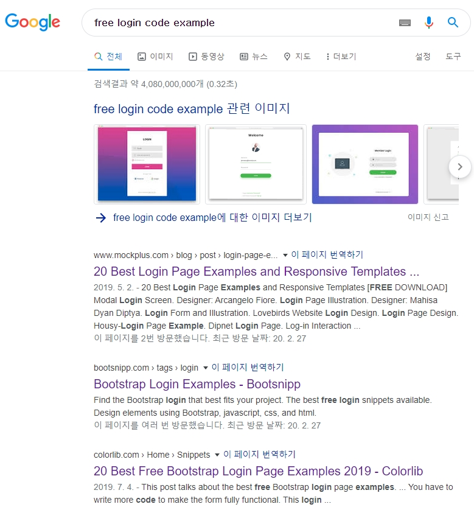
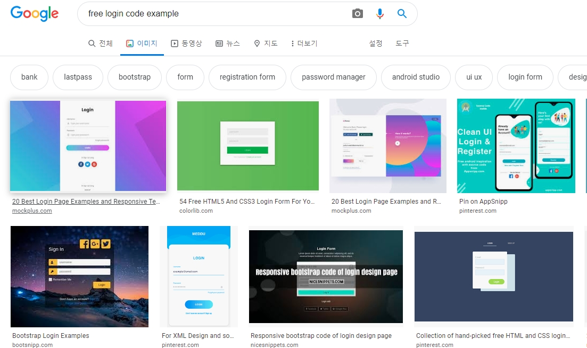
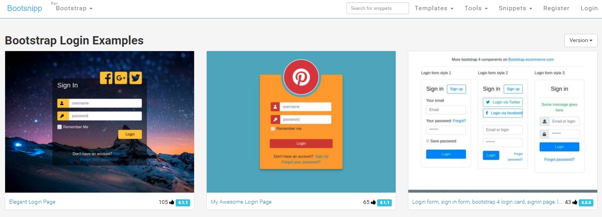
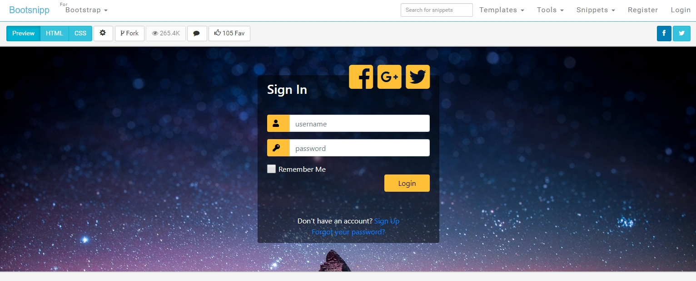
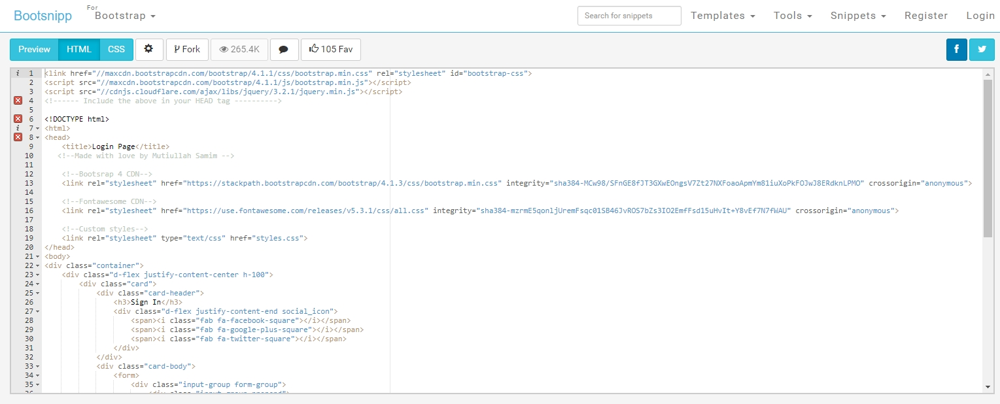
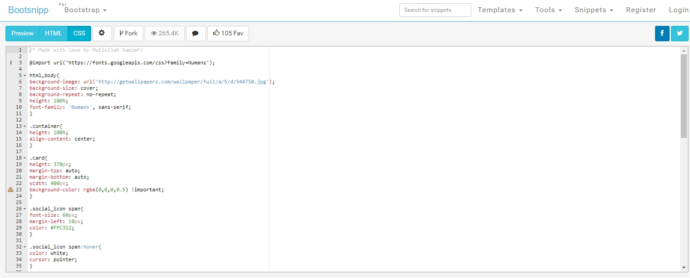
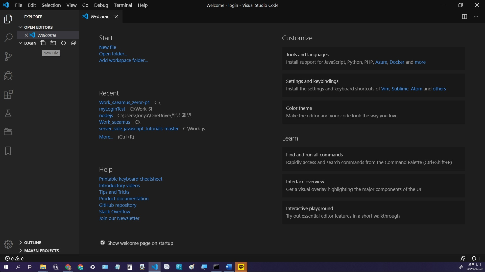
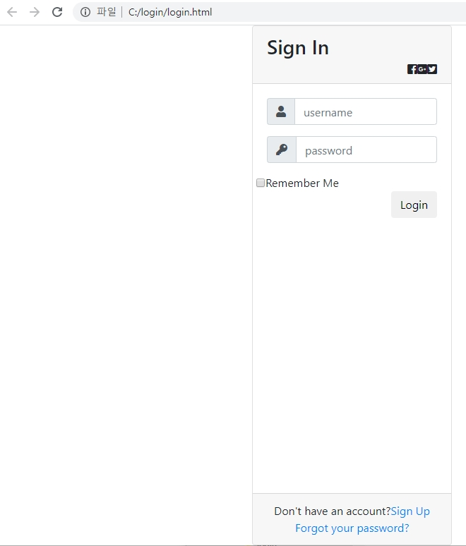
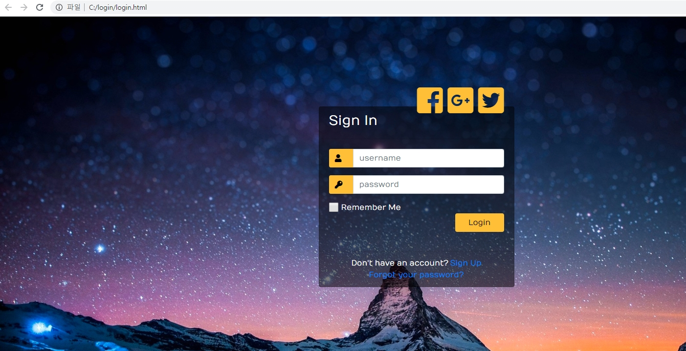

# Login창 만드는 방법    
     

### 목적
    
웹 페이지에서 login 기능은 필수 기능이고 또한 다양한 login창이 존재하는 현실에서 이런 다양한 요구 사항을 좀더 쉽게 적용할 수 있는 방법을 찾아 봅니다.

### 분석

구글에서 login의 다양한 형태를 찾아 봅니다.    
예를 들어 **"free login code example"** 입력합니다.

    

여기서 **이미지**를 선택하여 봅니다.    
다양한 login 창 그림을 조사하여 login에 들어가는 항목들을 찾아서 정리해 봅니다.

    

#### login에 들어가는 항목 정리    

    1. Login Logo
    2. Title
    3. ID / Username / Email
    4. Password
    5. Login Button / Sign in
    6. Remember me: check box / 로그인 상태 유지
    7. Forgot Password? / ID 찾기
    8. Create an Account
    9. Twitter / facebook /SNS 계정으로 LOG IN
    10. 일회용 로그인
    11. 전화번호 로그인
   

### 설계
먼저 login을 다른 사람들은 어떻게 코드 작성을 하여 구현했는지 찾아봅니다.   

구글 **"free login code example"** 검색에서 찾아보면
Bootstrap Login Examples - Bootsnipp: <https://bootsnipp.com/tags/login> 이라는 사이트가 있습니다.

      

이중에서 처음 것을 눌러보면 

    

여기서 HTML 버턴을 눌러보면

    

CSS 버턴을 눌러보면    

    

코드가 HTML과 CSS로 이루어져 있는 것을 알 수 있습니다.
일단 이 사이트 내용과 같은 스펙으로 적용해보고나서 우리의 설계안을 만들어서
코드 수정를 해봅니다.

### 적용    

위에서 구한 코드를 실제로 적용해 봅니다.
에디터는 VSCode를 사용합니다.    
구글에서 **"vscode 설치하기"** 로 검색하여 설치하면 됩니다.    
참조: <https://webnautes.tistory.com/1197>    

명령 프롬프트 창을 열고 원하는 디렉토리(예 login)를 만들고 그디렉토리로 가서
code .을 입력하면 vscode창이 열립니다.    

    mkdir c:\login
    cd c:\login
    code .

New File을 눌러서 "login.html"이라고 입력합니다.    
위에서 구한 HTML 코드를 복사하여 붙여넣기를 합니다.    

VSCode에서 파일을 브라우저에서 볼 수 있는 프러그인을 설치 합니다.    
구글에서 **vscode view in browser**를 입력합니다.    
  
    
[Open In Browser](https://kamang-it.tistory.com/entry/VisualStudioCode%ED%94%8C%EB%9F%AC%EA%B7%B8%EC%9D%B8Open-In-Browser-vscode%EC%97%90%EC%84%9C-html%EC%9D%84-%EB%B0%94%EB%A1%9C-%EB%B8%8C%EB%9D%BC%EC%9A%B0%EC%A0%80%EC%97%90%EC%84%9C-%ED%99%95%EC%9D%B8%ED%95%98%EC%9E%90)를 참고하여 설치합니다.  

login.html창에서 "Alt",  "B" key를 동시에 눌러서 브라우저에서 봅니다.    

    

아직 css 파일이 적용이 안되서 원래의 사이트의 모양과 다르게 나왔습니다.    

구글에서 **"html에 css 넣기"** 를 찾아봅니다.    
참고 <https://www.codingfactory.net/10529>    

HTML에 CSS를 적용시키는 방법은 세가지가 있습니다.     

  **1. Inline Style Sheet**              
  HTML 태그의 style 속성에 CSS 코드를 넣는 방법입니다.    
  예) \
Lorem ipsum dolor.\</p\>    
  **2. Internal Style Sheet**             
  HTML 문서 안의  안에 CSS 코드를 넣는 방법입니다.    
  예)
      \<style\>
      h1 {
        color: blue;
      }
      \<\/style\>    

  **3. Linking Style Sheet**       
  별도의 CSS 파일을 만들고 HTML 문서와 연결하는 방법입니다.    
  예)  \<link rel="stylesheet" href="style.css"\>        
       \<link rel="stylesheet" href="css/style.css"\>

3번째 방법으로 css  파일을 적용해 보겠습니다.    
login.html을 보면 \<head\> 와 \<\/head\> 사이에

    <!--Custom styles-->    
    <link rel="stylesheet" type="text/css" href="styles.css">    
라고 되어있으므로 같은 디렉토리에 login.html 만들 때와 같이 styles.css 파일을 만듭니다.    

위에서 찾은 **Bootstrap Login Examples - Bootsnipp**의 CSS 파일의 코드를
styles.css 파일에 붙여 넣기하고 login.html창에서 Alt+B key를 동시에 눌러서 브라우저에서 봅니다.   

 
 정상적으로 적용되었습니다.

 ## 정리
  지금까지 login 창을 웹브라우저에 손십게 표시할 수 있는 방법을 구글 검색을 톻해 찾아서 실제로 적용해 보왔습니다.
  향후 우리의 설계안을 만들어서 코드 수정를 하고, 실제 login 동작을 데이터 베이스와 연동하는 방법을 추가 할 예정입니다. 

