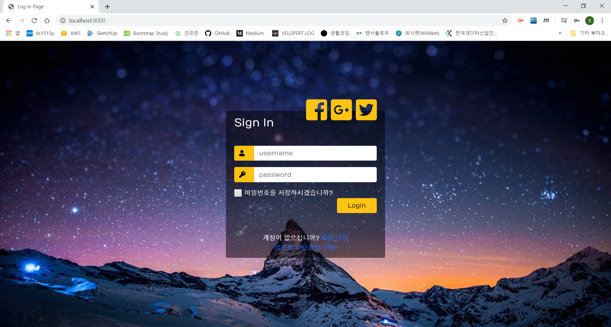

# zeror-p1

안녕하세요, ZR멤버 여러분
앞으로 많은 활동 부탁드립니다.^^

네, 그러시지요. - marco direct commit on desktop!!!

# Zero R 이란

IT 관련 분야에서 수십년간 종사하고 은퇴한 시니어들의 모임으로....  
4차산업 혁명 시대에 도움이 될만한 일을 하고자하여 자발적으로 모인 프로젝트 그룹입니다.

# 프로젝트 소개

## 목적

Nodejs, Javascript , Mysql 기반으로하는 웹 서버 구축 및 그룹웨어 프레임웍 개발

## 일정

1. AWS 웹서버 및 DB 서버 구축 ----진행율(100%)
2. login process 구축 ----진행율(95%)
3. menu generator 구축 ---- 진행율 (10%)
4. 향후 일정은 계속 update 될 예정입니다.

## 웹서버 접속

아래 주소로 접속하면 현재 시점까지 프로젝트에서 구현된 것을 직접 실행해 볼 수 있습니다.

http://15.164.212.170:8000

## Local에서 프로젝트를 실행하는 방법

프로젝트 소스는 node-project/testNode 폴더에 구성되어 있습니다.

#### 1.프로젝트 폴더를 clone 하거나 download 합니다.

#### 2.Nodejs 설치

    Node.js 공식 홈페이지에서 Node.js를 다운받을 수 있습니다.

        Current : 최신 버전
        LTS : 안정 버전

    Current는 최신 버전이므로, 버그가 있을 수 있으므로 안정버전인 LTS를 다운 받으시는것을 권장합니다.

[링크 : Nodejs다운로드](https://nodejs.org/en/)

    설치후 제대로 설치 되었는지 cmd 창에서 node와 npm의 버전을 확인해 봅니다.

    C:\Users\byun>node -v
    v10.15.0

    C:\Users\byun>npm -v
    6.4.1

#### 3.프로젝트 폴더로 경로 변경후 아래명령 실행합니다

    npm install

    npm start

#### 4. 정상적으로 실행되면 아래와 같이 출력될 것입니다.

    C:\Users\byun\Documents\Git-Saeamus\node-project\testNode>npm start

    > testnode@0.0.0 start C:\Users\byun\Documents\Git-Saeamus\node-project\testNode
    > nodemon app.js

    [nodemon] 2.0.2
    [nodemon] to restart at any time, enter `rs`
    [nodemon] watching dir(s): *.*
    [nodemon] watching extensions: js,mjs,json
    [nodemon] starting `node app.js`
    Express server listening on port 8000
    DB연결 성공

#### 5.이제 웹브라우저의 주소창에 아래와 같이 입력하면

    localhost:8000

아래 그림과 같이 login 접속화면이 뜨면 성공  
회원 가입해보시고 login도 해보세요 ^^

