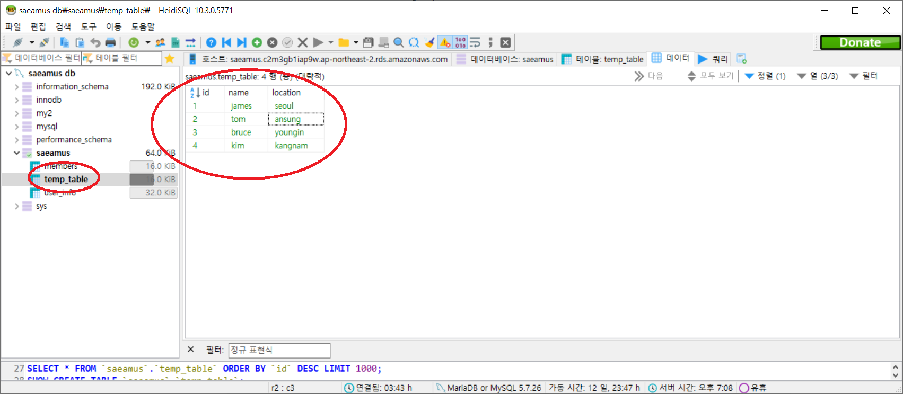

#### 20200310 원래글 내용은 doc/004b.어플리케이션의 생성 및 폴더의 구조.md 로 이동하였습니다.

#### 앞으로 여기서는 작업 진행상황에 따라 commit되는 파일들에 대해 간략한 설명을 하도록 할 예정입니다.

# 목차

[1.commit명: slickgrid test on t1sub1sub1 menu(1)](#slickgrid-test-on-t1sub1sub1-menu-1)

[2.commit명: slickgrid test on t1sub1sub1 menu(2)](#slickgrid-on-t1sub1sub1-menu-2)

[3.commit명: T1SUB1SUB2 페이지에 db table로 부터 Grid 띄우기](#t1sub1sub2-grid-from-db-table)

[4.commit명: T1SUB1SUB3 페이지 Grid에서 db CRUD 구현 ](#t1sub1sub3-grid-crud)

# 설명

# slickgrid test on t1sub1sub1 menu 1

commit을 한번에 처리해버려서 1,2차로 나누어서 설명합니다.

#### 목적 :

slickgrid를 t1sub1sub1 메뉴페이지에 연결하기 위한 test 작업입니다.
삽입할 Grid는 slickgrid의 simple예제입니다.  
 예제 링크:  
 <http://6pac.github.io/SlickGrid/examples/example1-simple.html>

#### 설명 :

1.  slickgrid를 install 합니다.

        npm install slickgrid

2.  view 폴더에 테스트용으로 layout-grid1.ejs 파일을 생성하고
    <https://github.com/6pac/SlickGrid/blob/master/examples/example1-simple.html>  
    로부터 html source를 복사해서 붙입니다.

3.  "head"와 "body"태그안의 link 되어있는 파일들을 local 폴더에 복사하고 경로를 수정합니다.

4.  route/module.js에서 router.get("/t1sub1sub1" ....의 라우팅 부분을 아래와 같이 수정합니다.

        수정전
        res.render("layout", { name: username, title: url2, content: t1sub1sub1_ren });
        });

        수정후
        res.render("layout-grid1", { name: username, title: url2, content: t1sub1sub1_ren });
        });

5.  프로젝트를 실행합니다.

        npm start

6.  화면에 메뉴바 없이 grid가 뜨면 성공입니다.

# slickgrid on t1sub1sub1 menu 2

#### 목적 :

slickgrid를 layout을 적용하여 t1sub1sub1 메뉴페이지에 연결하기 위한 test 작업입니다.(1번과 다른 점은 페이지 상하단에 header, menu, footer 레이아웃이 적용되고 grid는 본문 영역에 보여집니다)
삽입할 Grid는 slickgrid의 simple예제입니다.  
 예제 링크:  
 <http://6pac.github.io/SlickGrid/examples/example1-simple.html>

#### 설명 :

1.  slickgrid를 install 합니다.(생략)

        npm install slickgrid

2.  view 폴더에 테스트용으로 layout-grid2.ejs 파일을 생성하고
    <https://github.com/6pac/SlickGrid/blob/master/examples/example1-simple.html>  
    로부터 html source를 복사해서 붙입니다.

    view/layout.ejs의 내용을 layout-grid2.ejs에 복사해서 추가로 붙입니다.

3.  각 "head"와 "body"태그안의 link 되어있는 파일들을 하나의 html문서로 합칩니다.

4.  view/m-t1sub1sub1.ejs파일의 내용을  
    예제 링크:  
    <http://6pac.github.io/SlickGrid/examples/example1-simple.html>
    의 본문 부분만 복사해서 붙입니다.(여기서는 body의 table태그 부분만 복사함)

5.  route/module.js에서 router.get("/t1sub1sub1" ....의 라우팅 부분을 아래와 같이 수정합니다.

        수정전
        res.render("layout-grid1", { name: username, title: url2, content: t1sub1sub1_ren });
        });

        수정후
        res.render("layout-grid2", { name: username, title: url2, content: t1sub1sub1_ren });
        });

6.  프로젝트를 실행합니다.

        npm start

7.  화면과 같이 메뉴바와 함께 grid가 뜨면 성공입니다.  
    

8.  서버 http://15.164.212.170:8000 에 접속해서 T1SUB1SUB1메뉴 페이지로 이동하면 확인 됩니다.

# T1SUB1SUB2 grid from db table

#### 목적

T1SUB1SUB2 메뉴 페이지에
DB table로 부터 data를 불러들여 grid를 만드는 작업입니다.

#### 설명

1.  AWS db에 temp_table(column = id,name,location)을 만들고 data를 몇개 입력합니다.

    

2.  m1-t1sub1sub2.ejs 파일을 아래와 같이 수정합니다.

    AJAX get을 사용하여 db의 data를 불러 옵니다.  
    ajax에서 async:true이면 javascript 특성상 db에서 data를 가져오기 전에 아래 라인을 실행해서 grid를 그려버립니다.그러면 나중에 data를 가져와도 로딩 안됩니다.잘못된 의견:무조건 async:false로 셋팅해야합니다.(success function 안에서 async로 데이타를 모두 가져온 후 grid를 refresh하면 async true이라도 grid에 데이타를 표시할 수 있습니다)
    기본페이지가 그려진후 grid를 그리기위해 별도의 modules/t1sub1sub2/get으로 라우팅합니다.

         

3.  modules.js파일을 아래와 같이 수정합니다.
    AJAX GET METHOD로 라우팅되어 db의 temp_table에서 data를가져옵니다.

         router.get("/t1sub1sub2/get", function(req, res) {
         var sql = "select * from temp_table";
         mysqlDB.query(sql, function(err, results) {
            if (err) {
                 res.send("error : " + err);
            }
            if (!results[0]) {
                 res.send("nodata");
            }
            //console.log(results);
            res.send(results);
           });
         });

4)  화면과 같이 메뉴바와 함께 db에서 불러온 data로 grid가 뜨면 성공입니다.  
    

# T1SUB1SUB3 GRID CRUD

#### 목적

T1SUB1SUB3 메뉴페이지에 Grid상에서 CRUD를 구현합니다.

#### 설명

crud 자체만을 db와 연동하여 구현하는 것은 그리 어려운 작업은 아닙니다.
다시말하면 cell change나 Add row, delete row등 한개의 작업이 일어 날때 마다 매번 db와 연동하여 db table자체를 변경해버리는 것은 어려운 작업은 아닙니다.그러나 이런 프로세스는 합리적이지 못합니다.
왜냐하면, 시간상 제약이 발생할수도 있고, 수정작업이 잘못된 경우 취소 할 수 있어야 하기때문입니다.

그래서 실제로는 클라이언트 사이드에서 grid의 CRUD작업이 여러개 발생하고 ,수정된 상태는 웹페이지에 그대로 적용되어 나타나며,수정된 내용은 어딘가에 저장되어 있어야 합니다.  
그리고, 최종 확인(변경저장 버튼)을 할 경우에만 실제로 서버사이드의 작업(db 테이블 수정)이 일괄로 이루어 져야 됩니다.만약 최종확인을 안하고 변경취소(변경취소 버튼)를 할 경우 클라이언트 사이드의 모든 수정작업은 모두 이전 상태로 되돌려 져야 합니다.이때 db에는 아무런 영향도 주지 않습니다.

#### Grid에서 일어나는 작업의 종류

우선 Grid상에서 발생할 수 있는 기본적인 작업의 종류를 알아보겠습니다.(복잡한 것은 차차 구현할 예정입니다.)  
이것이 결국 구현하고자 하는 목표가 되겠네요...

1). DB 데이타 읽어서 Grid에 나타내기  
2). New Row 추가 -새로운 열을 1줄 추가  
3). Row 삭제 - Row를 1줄 또는 여러줄 선택하여 삭제  
4). cell 편집 - 한개 또는 여러개의 cell내용을 편집  
5). 각종 변경사항 발생시 Grid상에 즉시 적용되어 나타남.  
6). 7번,8번 수행안하고 변경취소시 모든 수정사항 되돌리기  
7). 변경사항 확인시 db에 수정사항 적용(db table 변경)  
8). 변경후 db 데이타 불러오기( Grid refresh )

한가지씩 알아보겠습니다.

#### 1. DB 데이타 읽어서 Grid에 나타내기

$Ajax()메소드를 사용하여 DB로부터 데이타를 읽어 옵니다.   
[$Ajax()의 자세한 설명](https://araikuma.tistory.com/640)

file경로: /views/m-t1sub1sub3.ejs  
메인 FUNCTION

     $(function() {
          getGrid();

          grid = new Slick.Grid("#myGrid", dataView, columns, options);

페이지가 로드(\$(function()~ )되면  
 Grid를 표시하기위해 db 데이터를 읽습니다.(getGrid())  
 읽어들인 데이타를 grid에 나타냅니다.(new Slick.Grid(....))
데이타는 dataView에 바인딩합니다.(grid의 2번째 인자)

getGrid() 함수

    function getGrid() {

     $.ajax({
          url: "/modules/t1sub1sub3/get",
          async: true,
          dataType: "json",
          type: "GET",
          success: function(result) {
          if (result) {
               for (var i = 0; i < result.length; i++) {
                    griddata[i] = {
                         id: result[i].id,
                         name: result[i].name,
                         location: result[i].location,
                         occupation: result[i].occupation,
                         hobby1: result[i].hobby1,
                         birth: result[i].birth,
                         address: result[i].address,
                         phone: result[i].phone,
                         check_bit: result[i].check_bit,
                         reg_date: result[i].reg_date,
                         upd_date: result[i].upd_date
                   };
               }
               maxPeak = result[0].cnt;
               dataView.beginUpdate();
               grid.invalidateAllRows();
               dataView.setItems(griddata);
               dataView.endUpdate();
               grid.render();
           }
          }
       });
     }

Ajax GET Method로 db temp_table에서 data read하는 함수입니다.  
success시 grid를 그리므로 async로 처리하여도 됩니다(async: true)

그럼 데이타를 읽으러 가야하겠죠?  
어디로 갈까요?

\$ajax()의 url에서 지정한 파일 경로 /routes/modules.js의 router.get("/t1sub1sub3/get", function(req, res){...}로 갑니다.(url: "/modules/t1sub1sub3/get")  
아래보면 라우터가 보이고 sql문도 보이네요...
sql문에 의해 데이타를 Query하고 그것을 results에 담아 반환합니다.

     router.get("/t1sub1sub3/get", function(req, res) {
          var sql = "select * ,(select count(*) from temp_table) as cnt from temp_table where del_chk != ?";
          var params = [1];
          mysqlDB.query(sql, params, function(err, results) {
               if (err) {
               res.send("error : " + err);
               }
               if (!results[0]) {
               res.send("nodata");
               }
               res.send(results);
          });
     });

success했으니까 넘어온 데이타(result)를 grid의 해당 field명에 for문을 사용하여 바인딩합니다. (\$ajax의 success:)
grid의 2번째 인자가 dataView 이므로 grid 그리기전에 먼저 dataView에 데이타를 바인딩합니다.(dataView.setItems(griddata))

이제 정상적으로 grid가 표시된는 것을 확인할수 있습니다.

#### 2. New Row 추가 -새로운 열을 1줄 추가

추가/삭제/취소등 동작을 하려면 버튼이 필요합니다.  
/views/m-t1sub1sub3.ejs파일에 버튼을 만들어 줍니다.  
Grid하단에 버튼이 생겼습니다.

          <button id="btnDelete" onclick="deleteRow()">ROW삭제</button>
          <button id="btnSave" onclick="saveData()">변경저장</button>
          <button id="btnCancel" onclick="cancelData()">변경취소</button>

/views/m-t1sub1sub3.ejs파일에서
Grid를 edit 가능하도록 설정해야합니다.
우선 각 행(column)의 입력 형태에 따라 해당 editor를 설정합니다
column 항목을 보면 다양한 editor가 보이네요...  
[SlickGrid의 column-options을 참고하세요](https://github.com/mleibman/SlickGrid/wiki/Column-Options)

     var columns = [
          {.....editor: Slick.Editors.Text,
                editor: Slick.Editors.Date,
                editor: Slick.Editors.LongText,
                editor: Slick.Editors.Checkbox

그리고 option항목에서 editable 셋팅을 해줍니다.  
[SlickGrid의 Grid Option을 참고하세요](https://github.com/mleibman/SlickGrid/wiki/Grid-Options)

     var options = {
          ....
          editable: true,
          enableAddRow: true,
          enableCellNavigation: true,
          asyncEditorLoading: true,
          forceFitColumns: false,
          topPanelHeight: 25,
          autoEdit: true //cell 클릭시 자동 입력 모드로 설정
     };

메인 함수에 보시면 아래처럼 설정해야합니다.

     $(function() {
          getGrid();

          grid = new Slick.Grid("#myGrid", dataView, columns, options);

데이타를 읽어와서 그리드에 표시

          grid.setSelectionModel(new Slick.RowSelectionModel());

클릭시 1개 Row가 선택됩니다.

          grid.setSelectionModel(new Slick.CellSelectionModel());

클릭시 1개의 cell만 선택됩니다.RowSelectionModel설정시 작동안합니다.

          var pager = new Slick.Controls.Pager(dataView, grid, $("#pager"));

그리드 밑에 pager를 표시합니다.

          var columnpicker = new Slick.Controls.ColumnPicker(columns, grid, options);

아직 columnPicker의 정확한 기능은 모르겠네요..
선택에 따라서 column을 숨기거나 나타나게 하는 기능 인 것 같습니다.  
 http://jsfiddle.net/mikemsq/2586p/18/

이제 그리드의 맨 아래로 가서 비어있는 cell을 클릭하면 새로운 Row의 입력창이 나타나는 것을 볼수있습니다.
